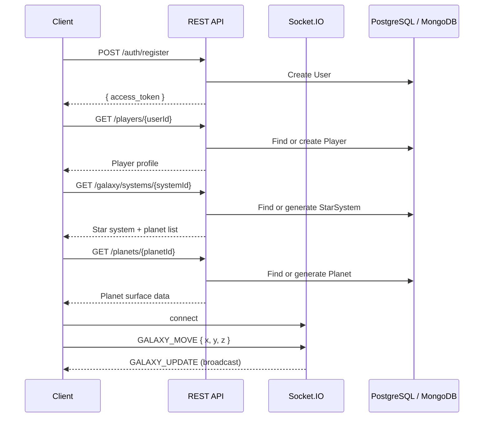

# Infinity Server — REST & WebSocket API

```yaml
date: 2026-06-07
author: Roro LeSage
model: Composer
type: API Reference
sources:
  - src/modules/auth/
  - src/modules/players/
  - src/modules/galaxy/
  - src/modules/planets/
  - src/modules/resources/
  - src/modules/socket/
  - src/main.ts
  - src/config/app.config.ts
  - src/config/socket.config.ts
```

Reference for **implemented** HTTP routes and Socket.IO events on the Infinity NestJS server. This document reflects the current codebase, not planned contracts (see `documentation/stellar-gate-api.md` for the StellarGate client auth target).

---

## Base URL

| Environment | URL |
|-------------|-----|
| Local development | `http://localhost:4000` |

Port is configurable via the `PORT` environment variable (default `4000`).

There is **no global route prefix** today (`main.ts` does not call `setGlobalPrefix`). Routes are served at the paths listed below (e.g. `/auth/login`, not `/infinity/auth/login`).

---

## Cross-cutting behavior

### Content type

All REST endpoints accept and return **JSON** (`Content-Type: application/json`).

### Validation

A global `ValidationPipe` is active. Invalid request bodies return **400 Bad Request** with a NestJS validation error payload:

```json
{
  "statusCode": 400,
  "message": ["password must be longer than or equal to 6 characters"],
  "error": "Bad Request"
}
```

### CORS

CORS is enabled with `origin: '*'` and `credentials: true` (development only — restrict before production).

### Authentication (current state)

| Aspect | Value |
|--------|-------|
| Mechanism | JWT signed with `JWT_SECRET` |
| Token delivery | JSON field `access_token` on `POST /auth/login` and `POST /auth/register` |
| Token lifetime | `1h` (`appConfig.jwt.expiresIn`) |
| Protected routes | **None** — `JwtStrategy` is registered but no controller uses `@UseGuards(JwtAuthGuard)` yet |
| Expected header (when guards are added) | `Authorization: Bearer <access_token>` |

---

## REST endpoints

### Summary

| Method | Path | Auth | Description |
|--------|------|------|-------------|
| `GET` | `/health` | Public | Server health check |
| `POST` | `/auth/register` | Public | Create account and return JWT |
| `POST` | `/auth/login` | Public | Authenticate and return JWT |
| `GET` | `/players/:userId` | Public | Get or create player profile for a user |
| `PATCH` | `/players/:playerId/position` | Public | Update player position |
| `GET` | `/galaxy/systems/:systemId` | Public | Get or generate a star system |
| `GET` | `/planets/:planetId` | Public | Get or generate a planet |
| `GET` | `/resources/planet/:planetId` | Public | List resources on a planet |

---

### Health

#### `GET /health`

Lightweight health check. Does not verify database connectivity.

**Success response — 200 OK**

```json
{
  "name": "infinity-server",
  "version": "0.2.0",
  "status": "OK"
}
```

| Field | Type | Description |
|-------|------|-------------|
| `name` | string | Package name from `package.json` |
| `version` | string | Semantic version from `package.json` |
| `status` | string | Always `"OK"` when the server is running |

---

### Auth

#### `POST /auth/register`

Create a new user account. On success, returns a JWT (same shape as login).

**Request body**

| Field | Type | Required | Rules |
|-------|------|----------|-------|
| `username` | string | yes | non-empty |
| `password` | string | yes | min length 6 |
| `email` | string | no | valid email if provided |

**Example request**

```http
POST /auth/register
Content-Type: application/json

{
  "username": "pilot42",
  "password": "secret123",
  "email": "pilot@example.com"
}
```

**Success response — 201 Created** (implicit 200 from NestJS default)

```json
{
  "access_token": "eyJhbGciOiJIUzI1NiIsInR5cCI6IkpXVCJ9..."
}
```

**Error responses**

| Status | Condition |
|--------|-----------|
| `400` | Validation failure (missing username, short password, invalid email) |
| `500` | Username already exists (PostgreSQL unique constraint on `username`) |

---

#### `POST /auth/login`

Validate credentials and return a JWT.

**Request body**

| Field | Type | Required | Rules |
|-------|------|----------|-------|
| `username` | string | yes | non-empty |
| `password` | string | yes | min length 6 |

**Example request**

```http
POST /auth/login
Content-Type: application/json

{
  "username": "pilot42",
  "password": "secret123"
}
```

**Success response — 200 OK**

```json
{
  "access_token": "eyJhbGciOiJIUzI1NiIsInR5cCI6IkpXVCJ9..."
}
```

JWT payload (decoded):

```json
{
  "username": "pilot42",
  "sub": "<user-uuid>",
  "iat": 1717776000,
  "exp": 1717779600
}
```

**Error responses**

| Status | Body |
|--------|------|
| `401 Unauthorized` | `{ "statusCode": 401, "message": "Invalid credentials" }` |
| `400 Bad Request` | Validation errors |

---

### Players

Player data is stored in **PostgreSQL** (TypeORM `Player` entity).

#### `GET /players/:userId`

Fetch the player profile linked to a user. If none exists, a new player is created with default position `(0, 0, 0)`.

**Path parameters**

| Name | Type | Description |
|------|------|-------------|
| `userId` | UUID string | `User.id` from auth |

**Success response — 200 OK**

```json
{
  "id": "a1b2c3d4-e5f6-7890-abcd-ef1234567890",
  "userId": "f47ac10b-58cc-4372-a567-0e02b2c3d479",
  "galaxyX": 0,
  "galaxyY": 0,
  "galaxyZ": 0,
  "currentPlanetId": null,
  "planetX": 0,
  "planetY": 0,
  "createdAt": "2026-06-07T12:00:00.000Z",
  "updatedAt": "2026-06-07T12:00:00.000Z"
}
```

The `user` relation is not eagerly loaded in the response.

---

#### `PATCH /players/:playerId/position`

Partially update a player's galaxy or planet coordinates.

**Path parameters**

| Name | Type | Description |
|------|------|-------------|
| `playerId` | UUID string | `Player.id` |

**Request body** — all fields optional; only provided fields are updated.

| Field | Type | Description |
|-------|------|-------------|
| `galaxyX` | number | Galaxy-space X coordinate |
| `galaxyY` | number | Galaxy-space Y coordinate |
| `galaxyZ` | number | Galaxy-space Z coordinate |
| `currentPlanetId` | string | Active planet identifier |
| `planetX` | number | Surface X coordinate |
| `planetY` | number | Surface Y coordinate |

**Example request**

```http
PATCH /players/a1b2c3d4-e5f6-7890-abcd-ef1234567890/position
Content-Type: application/json

{
  "galaxyX": 120.5,
  "galaxyY": -45.2,
  "galaxyZ": 10,
  "currentPlanetId": "system_alpha_planet_0",
  "planetX": 32,
  "planetY": 18
}
```

**Success response — 200 OK**

Returns the updated `Player` object (same shape as `GET /players/:userId`).

**Error responses**

| Status | Condition |
|--------|-----------|
| `404 Not Found` | `{ "statusCode": 404, "message": "Player <id> not found" }` |
| `400 Bad Request` | Invalid field types |

---

### Galaxy

Star systems are stored in **MongoDB** (Mongoose). Systems are **generated on first access** if the `systemId` does not exist (deterministic from seed).

#### `GET /galaxy/systems/:systemId`

**Path parameters**

| Name | Type | Description |
|------|------|-------------|
| `systemId` | string | Unique system identifier (used as MongoDB `_id` and generation seed) |

**Example request**

```http
GET /galaxy/systems/alpha-centauri
```

**Success response — 200 OK**

```json
{
  "_id": "alpha-centauri",
  "name": "Star System alpha-cen",
  "stars": [
    {
      "id": "alpha-centauri_star_0",
      "type": "yellow",
      "x": 50.12,
      "y": 3.45,
      "mass": 1.23,
      "temperature": 5800.5
    }
  ],
  "planets": [
    {
      "id": "alpha-centauri_planet_0",
      "name": "Planet 1",
      "x": 142.8,
      "y": 67.3,
      "radius": 8.4,
      "type": "rocky",
      "resources": {
        "iron": 742,
        "gold": 128,
        "water": 1533
      }
    }
  ],
  "visited": true,
  "createdAt": "2026-06-07T12:00:00.000Z",
  "updatedAt": "2026-06-07T12:00:00.000Z"
}
```

**Star types:** `yellow`, `red`, `blue`, `white`  
**Planet types:** `rocky`, `gas`, `ice`, `lava`

Planet count and layout are procedurally derived from `systemId`. The same `systemId` always yields the same system once persisted.

---

### Planets

Planet surface data is stored in **MongoDB**. Planets are **generated on first access** if the `planetId` does not exist.

#### `GET /planets/:planetId`

**Path parameters**

| Name | Type | Description |
|------|------|-------------|
| `planetId` | string | Unique planet identifier (MongoDB `_id` and generation seed) |

**Example request**

```http
GET /planets/alpha-centauri_planet_0
```

**Success response — 200 OK**

```json
{
  "_id": "alpha-centauri_planet_0",
  "name": "Planet alpha-cen",
  "starSystemId": "unknown",
  "seed": "alpha-centauri_planet_0",
  "biomeTypes": ["grass", "ocean", "mountain", "desert"],
  "resources": {
    "iron": 3200,
    "gold": 890,
    "water": 7500,
    "crystal": 412
  },
  "heightMap": [[0.12, -0.05, ...], ...],
  "tileMap": [["grass", "water", ...], ...],
  "visited": true,
  "createdAt": "2026-06-07T12:00:00.000Z",
  "updatedAt": "2026-06-07T12:00:00.000Z"
}
```

| Field | Description |
|-------|-------------|
| `heightMap` | 64×64 grid of elevation values (Perlin noise, range roughly −1 to 1) |
| `tileMap` | 64×64 grid of tile types: `grass`, `sand`, `water`, `stone`, `snow`, `dirt` |
| `biomeTypes` | Derived biome labels: `grass`, `desert`, `forest`, `ocean`, `mountain`, `tundra` |
| `resources` | Aggregate resource quantities for the planet surface |

> **Note:** When a planet is generated via this endpoint alone, `starSystemId` defaults to `"unknown"`. Planets referenced inside a star system's `planets[]` array use IDs like `{systemId}_planet_{index}`.

---

### Resources

Resource deposits are stored in **MongoDB** as separate documents linked by `planetId`.

#### `GET /resources/planet/:planetId`

List all resource nodes on a planet.

**Path parameters**

| Name | Type | Description |
|------|------|-------------|
| `planetId` | string | Planet identifier |

**Example request**

```http
GET /resources/planet/alpha-centauri_planet_0
```

**Success response — 200 OK**

Returns an array (possibly empty if no resource documents exist for that planet):

```json
[
  {
    "_id": "665a1b2c3d4e5f6789012345",
    "planetId": "alpha-centauri_planet_0",
    "type": "iron",
    "x": 24,
    "y": 31,
    "quantity": 100,
    "createdAt": "2026-06-07T12:00:00.000Z",
    "updatedAt": "2026-06-07T12:00:00.000Z"
  }
]
```

**Resource types** (game constants): `iron`, `gold`, `water`, `crystal`

> **Note:** Procedural planet generation populates aggregate `resources` on the planet document but does not automatically create individual `Resource` collection entries. This endpoint reads the dedicated `resources` collection only.

---

## WebSocket API (Socket.IO)

The server attaches Socket.IO to the same HTTP port as the REST API.

| Setting | Value |
|---------|-------|
| Namespace | `/` (default) |
| Transports | `websocket` only |
| CORS | `origin: '*'` |
| Connection recovery | 2 minutes max disconnection |

Connect from a client:

```javascript
import { io } from 'socket.io-client';

const socket = io('http://localhost:4000', { transports: ['websocket'] });
```

### Events summary

| Direction | Event | Description |
|-----------|-------|-------------|
| Client → Server | `GALAXY_MOVE` | Player moved in galaxy space |
| Server → Client | `GALAXY_UPDATE` | Broadcast galaxy movement to all clients |
| Client → Server | `PLANET_MOVE` | Player moved on a planet surface |
| Server → Client | `PLANET_UPDATE` | Planet-room movement update |

Authentication is **not** enforced on WebSocket connections today.

---

### `GALAXY_MOVE` (client → server)

Notify the server of a position change in galaxy coordinates.

**Payload**

| Field | Type | Description |
|-------|------|-------------|
| `x` | number | Galaxy X |
| `y` | number | Galaxy Y |
| `z` | number | Galaxy Z |

**Example**

```javascript
socket.emit('GALAXY_MOVE', { x: 120.5, y: -45.2, z: 10 });
```

**Server behavior**

- Logs the movement (via `GalaxyService.handlePlayerMove`)
- Broadcasts `GALAXY_UPDATE` to **all** connected clients

---

### `GALAXY_UPDATE` (server → client)

**Payload**

| Field | Type | Description |
|-------|------|-------------|
| `playerId` | string | Socket.IO client id (not game `Player.id`) |
| `x` | number | Galaxy X |
| `y` | number | Galaxy Y |
| `z` | number | Galaxy Z |

```javascript
socket.on('GALAXY_UPDATE', (data) => {
  // { playerId: 'abc123', x: 120.5, y: -45.2, z: 10 }
});
```

---

### `PLANET_MOVE` (client → server)

Notify the server of movement on a planet surface. Clients should join the planet room (Socket.IO room named after `planetId`) to receive updates for that planet.

**Payload**

| Field | Type | Description |
|-------|------|-------------|
| `planetId` | string | Planet identifier (also used as room name) |
| `x` | number | Surface X |
| `y` | number | Surface Y |

**Example**

```javascript
socket.emit('join', planetId); // room join — not yet handled server-side
socket.emit('PLANET_MOVE', { planetId: 'alpha-centauri_planet_0', x: 32, y: 18 });
```

**Server behavior**

- Logs the movement (via `PlanetsService.handlePlayerMove`)
- Emits `PLANET_UPDATE` to the room `planetId` only

> **Gap:** The gateway does not currently handle a `join` message to add clients to planet rooms. Room membership must be set up before `PLANET_UPDATE` delivery works as intended.

---

### `PLANET_UPDATE` (server → client)

**Payload**

| Field | Type | Description |
|-------|------|-------------|
| `playerId` | string | Socket.IO client id |
| `planetId` | string | Planet identifier |
| `x` | number | Surface X |
| `y` | number | Surface Y |

```javascript
socket.on('PLANET_UPDATE', (data) => {
  // { playerId: 'abc123', planetId: 'alpha-centauri_planet_0', x: 32, y: 18 }
});
```

---

## Typical client flow



---

## Related documentation

| Document | Scope |
|----------|-------|
| `documentation/stellar-gate-api.md` | Target auth contract for the StellarGate client (cookie-based JWT, `/infinity` prefix) |
| `AGENTS.md` | Module architecture, env vars, dev commands |
| `documentation/server-setup.md` | Deployment and infrastructure |

---

## Not implemented (out of scope for this reference)

- JWT guards on protected routes
- Cookie-based session auth
- Global `/infinity` route prefix
- Redis-backed session or position caching
- REST endpoint for resource harvesting (`ResourcesService.harvest` is service-only)
