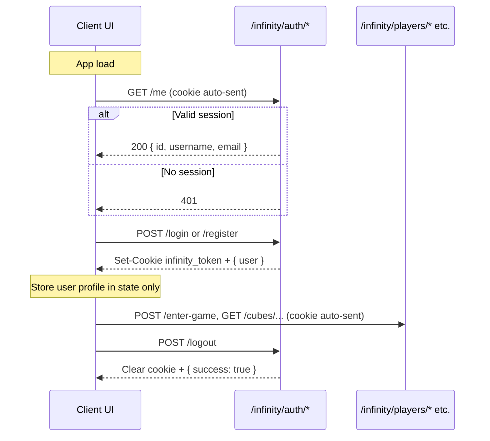

# Authentication — Client Guide

```yaml
date: 2026-06-13
author: Roro LeSage
model: Composer
sources:
  - src/modules/auth/
  - src/modules/auth/constants/auth-cookie.ts
  - src/modules/auth/strategies/jwt.strategy.ts
  - documentation/infinity-api.md
  - documentation/stellar-gate-api.md
  - ../../stellar-gate/documentation/infinity/stellar-gate-api.md
  - ../../stellar-gate/src/services/api.ts
  - ../../stellar-gate/src/services/authService.ts
  - ../../cosmos-governance/src/services/authService.ts
```

How **Infinity web clients** and **API consumers** must interact with the server authentication scheme. For full request/response shapes, see [infinity-api.md](./infinity-api.md) (Auth section) and [stellar-gate-api.md](./stellar-gate-api.md).

---

## Overview

Infinity uses **stateless JWT sessions**. The server signs a token after login or register and delivers it to the client. Protected routes accept the JWT from either:

| Transport | Intended use |
|-----------|----------------|
| **`httpOnly` cookie** `infinity_token` | Browser clients (Stellar Gate, future game clients) |
| **`Authorization: Bearer <jwt>`** header | E2E tests, CLI scripts, non-browser tools |

The server **does not** return `access_token` in the JSON body. Browser clients **must not** store the JWT in JavaScript (`localStorage`, `sessionStorage`, or in-memory globals used as a token cache).

JWT lifetime is **1 hour** (cookie `Max-Age` and JWT `exp` are aligned).

---

## Cookie contract

Set on successful `POST /infinity/auth/login` and `POST /infinity/auth/register`:

| Attribute | Value |
|-----------|--------|
| Name | `infinity_token` |
| `HttpOnly` | `true` |
| `Path` | `/infinity` — sent only to API routes under `/infinity/*` |
| `SameSite` | `Lax` |
| `Secure` | `true` when `NODE_ENV=production` |
| `Max-Age` | `3600` (1 hour) |

Cleared on successful `POST /infinity/auth/logout` (same path/flags on clear).

Because `Path=/infinity`, the cookie is **not** sent to SPA asset paths (e.g. `/stellar-gate/`) — only to `/infinity/*`. That is intentional.

---

## Auth endpoints (client view)

| Method | Path | Auth | Client action |
|--------|------|------|---------------|
| `POST` | `/infinity/auth/register` | No | Send credentials → read `{ user }` from body; cookie is set automatically |
| `POST` | `/infinity/auth/login` | No | Same as register |
| `GET` | `/infinity/auth/me` | JWT | Session restore on app load |
| `POST` | `/infinity/auth/logout` | JWT | End session; cookie cleared server-side |
| `POST` | `/infinity/auth/forgot-password` | No | Stub — always `{ success: true }`; no email sent yet |

### Response shapes (important)

| Endpoint | Success body |
|----------|----------------|
| `login`, `register` | `{ "user": { "id", "username", "email" } }` |
| `me` | **Flat** `{ "id", "username", "email" }` — no `user` wrapper |
| `logout` | `{ "success": true }` |
| `forgot-password` | `{ "success": true }` |

Register returns **`201 Created`**; login returns **`200 OK`**.

### Errors clients should handle

| Code | Typical cause | Suggested client behavior |
|------|---------------|---------------------------|
| `400` | Validation failed | Show `message` (string or array) from NestJS body |
| `401` | Invalid credentials, missing/expired session | Stay on login form or redirect to login |
| `409` | Username already taken (register) | Show *Username already taken* |

---

## Browser client requirements

### 1. Same-origin API calls (recommended)

In local development, serve the client and proxy `/infinity/*` to the NestJS server on the **same host and port** (Caddy on `:80`, or Vite dev proxy on `:3001` / `:3002`).

Use **relative URLs**:

```text
POST /infinity/auth/login
GET  /infinity/auth/me
POST /infinity/players/me/enter-game
```

Do **not** hard-code `http://localhost:4000` in browser code. Cookies are bound to the page origin; cross-port calls require explicit CORS and `withCredentials`.

### 2. Enable credentials on the HTTP client

For Axios (Stellar Gate pattern):

```typescript
export const api = axios.create({
  baseURL: '/infinity/auth',
  withCredentials: true,
});
```

For `fetch`:

```typescript
fetch('/infinity/auth/me', { credentials: 'include' });
```

On **same-origin** requests, browsers send cookies by default; `withCredentials` / `credentials: 'include'` is still recommended for clarity and for cross-origin setups.

### 3. Do not read or persist the JWT in JavaScript

| Do | Don't |
|----|-------|
| Rely on the browser sending `infinity_token` on `/infinity/*` | Parse `Set-Cookie` in JS |
| Keep `{ id, username, email }` in app state after login/register | Store JWT in `localStorage` / `sessionStorage` |
| Call `GET /me` on startup to restore session | Assume login/register alone survives a full page reload without `/me` |

### 4. Session lifecycle



**Register / login:** use `response.data.user` (wrapped).

**Restore session:** call `GET /infinity/auth/me` once when the app mounts. Treat `401` or network failure as logged out.

**Logout:** call `POST /infinity/auth/logout`, then clear local user state even if the request fails.

**Game API calls:** any axios/fetch instance that hits `/infinity/*` must send cookies. Either use one client with `baseURL: '/infinity'` and `withCredentials: true`, or separate clients that all set `withCredentials: true`.

---

## Cross-origin development (optional)

If the client runs on a **different origin** than the API (e.g. Vite on `http://localhost:5173` calling `http://localhost:4000` directly):

1. Set `CORS_ORIGIN` to the **exact** client origin (not `*`).
2. Use `withCredentials: true` on every authenticated request.
3. Expect stricter cookie behavior; prefer the reverse-proxy same-origin setup instead.

Production should use same-origin via reverse proxy when possible.

---

## Non-browser clients (tests, scripts, admin tools)

The server accepts **`Authorization: Bearer <jwt>`** on any JWT-protected route. Cookie and Bearer are equivalent for authorization.

Typical flow for automated tests:

1. `POST /infinity/auth/register` → read JWT from `Set-Cookie: infinity_token=...`
2. Attach `Authorization: Bearer <jwt>` on subsequent requests **or** send the cookie header

E2E helpers in this repo parse `Set-Cookie` and use Bearer for convenience; both paths are valid.

---

## Protected routes (beyond auth)

These require a valid JWT (cookie or Bearer):

| Area | Examples |
|------|----------|
| Session | `GET /infinity/auth/me`, `POST /infinity/auth/logout` |
| First spawn | `POST /infinity/players/me/enter-game` |
| Galaxy | `/infinity/cubes/*`, `/infinity/stars/*`, `/infinity/galaxy/systems/*` |
| Admin | `/infinity/admin/*` (also requires `role: "admin"` — see [admin-api.md](./admin-api.md)) |

Public routes (no JWT): `/infinity/health`, auth register/login/forgot-password, most `GET /infinity/players/*`, planets, resources.

---

## Client implementation status

| Client | Auth approach | Status |
|--------|---------------|--------|
| **Stellar Gate** | Cookie + `withCredentials`; no token in JS | **Aligned** — reference implementation |
| **Cosmos Governance** | Expects `access_token` in JSON + `sessionStorage` | **Broken** — needs realignment to cookie model (or Bearer extracted from cookie flow) |
| **Future game clients** (Galaxy, Solaris, Terra View) | Should follow Stellar Gate pattern | Not implemented |

### Stellar Gate (reference)

- `baseURL: '/infinity/auth'`, `withCredentials: true`
- `authService.login/register` → `response.data.user`
- `authService.getCurrentUser` → `GET /me` (flat user)
- `authStore.restoreSession()` on app bootstrap

See [../../stellar-gate/documentation/infinity/stellar-gate-api.md](../../stellar-gate/documentation/infinity/stellar-gate-api.md).

### Cosmos Governance (needs update)

Still reads `response.data.access_token` after login. After the server auth alignment, login returns `{ user }` only and sets the cookie. Admin API calls must switch to cookie-based requests (`withCredentials: true`) or read the JWT from `Set-Cookie` for Bearer — tracked in [../../documentation/TO-BE-FIXED.md](../../documentation/TO-BE-FIXED.md) §10.

---

## Security notes

- **Logout is client-side cookie clear + stateless JWT** — no server-side revocation list yet. A stolen JWT remains valid until expiry (~1 hour).
- **Forgot-password** is a no-op stub; do not promise email delivery in UI copy until a mail service exists.
- **Admin routes** require JWT **and** `role: "admin"` in the token payload. Regular user sessions must not access `/infinity/admin/*`.
- Auth responses expose `{ id, username, email }` only — never `password` or `role` in auth endpoint bodies (role is inside the JWT for guards).

---

## Related documents

| Document | Scope |
|----------|-------|
| [infinity-api.md](./infinity-api.md) | Full HTTP reference including auth payloads |
| [stellar-gate-api.md](./stellar-gate-api.md) | Stellar Gate contract mirror |
| [admin-api.md](./admin-api.md) | Admin login and `/infinity/admin/*` |
| [auth-alignment-development-plan.md](./auth-alignment-development-plan.md) | Server implementation plan (completed) |
| [../../stellar-gate/documentation/archive/auth-alignment-development-plan.md](../../stellar-gate/documentation/archive/auth-alignment-development-plan.md) | Stellar Gate verification plan (completed, archived) |
| [TO-BE-FIXED.md](./TO-BE-FIXED.md) | Remaining client-side auth follow-ups |
