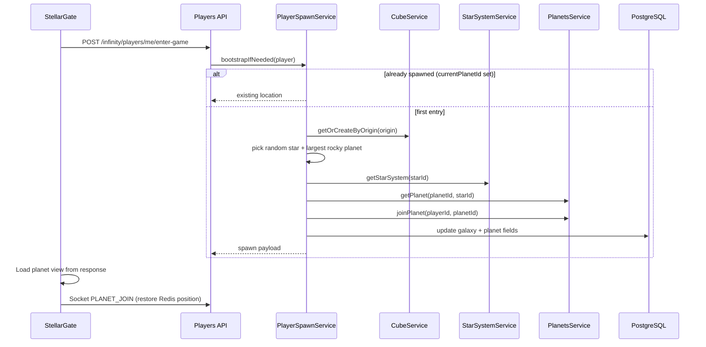
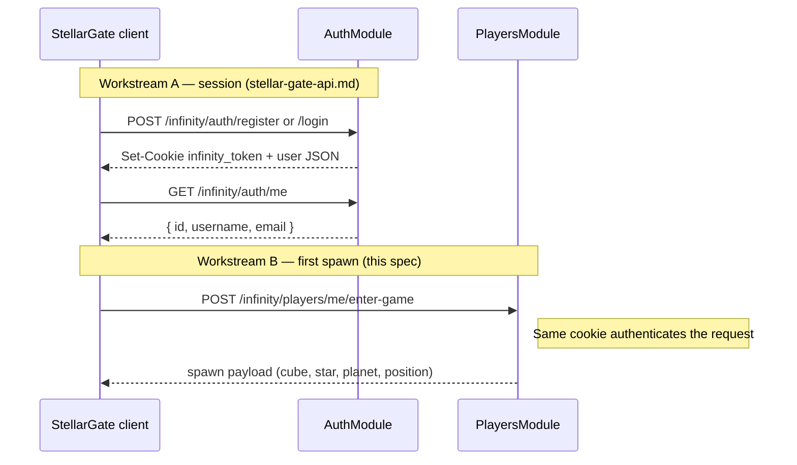

# First Planet — Player Spawn Specification

```yaml
date: 2026-06-11
author: Roro LeSage
model: Composer
sources:
  - src/modules/players/players.service.ts
  - src/modules/players/entities/player.entity.ts
  - src/modules/galaxy/cube.service.ts
  - src/modules/galaxy/star-system.service.ts
  - src/modules/planets/planets.service.ts
  - src/shared/constants/galaxy.constants.ts
  - src/shared/utils/coordinates.ts
  - documentation/stellar-gate-api.md
  - documentation/infinity-api.md
  - documentation/planets/development-plan.md
  - documentation/objects/cube.md
  - documentation/objects/star.md
  - documentation/objects/planet.md
  - src/shared/utils/galaxy-generation.ts
  - src/shared/utils/procedural-generation.ts
  - src/shared/constants/game.constants.ts
  - documentation/objects/star-system.md
  - documentation/galaxy/cube-based-star-system.md
```

## Overview

When a player enters the game for the **first time** from **StellarGate** (after register or login), they must appear on a **new planet** that did not exist before. The server orchestrates the full procedural chain:

1. Create a **cube** (if absent at the chosen origin).
2. Select a **star** inside that cube (random).
3. Create a **star system** for that star (if absent).
4. Select the **largest `rocky` planet** from the system summary.
5. Create the **planet** document (surface generation).
6. Assign a **spawn position** on the planet surface and persist the player's location.

This document tracks the design discussed for that flow. **Status: implemented** — see [development-plan.md](./development-plan.md).

---

## Problem statement

Today, authentication and world generation are disconnected:

| Step | Current behavior |
|------|------------------|
| `POST /infinity/auth/register` | Creates a `User` only — no `Player`, no world |
| `GET /infinity/players/:userId` | Creates a `Player` at galaxy `(0, 0, 0)` with `currentPlanetId: null` |
| Galaxy / planet access | Each layer is lazy-generated when a client explicitly requests it |

StellarGate can authenticate a user, but there is no single server action that places a new player on a ready-to-play planet.

---

## Target flow



### StellarGate integration sequence

1. `POST /infinity/auth/register` or `login` → session cookie (`infinity_token`).
2. `GET /infinity/auth/me` → resolve `userId`.
3. **`POST /infinity/players/me/enter-game`** → bootstrap world + return spawn payload (**first time only**; idempotent on repeat).
4. Client renders planet view directly from the response.
5. Socket.IO `PLANET_JOIN` with `planetId` → restores the Redis position written during step 3.

---

## Existing building blocks

Each generation step is already implemented as lazy get-or-create. **No new procedural generators are required.**

| Step | Service | Method | Notes |
|------|---------|--------|-------|
| Cube + stars | `CubeService` | `getOrCreateByOrigin(origin)` | Grid-aligned origin (multiples of `10` LY). Persists to MongoDB + Redis cache. |
| Star system | `StarSystemService` | `getStarSystem(starId)` | `_id` = `starId`. Generates `planets[]` summaries on first access. |
| Planet detail | `PlanetsService` | `getPlanet(planetId, systemId)` | Materializes `Planet` from summary; **gas** → 422, no document. |
| Surface spawn | `PlanetsService` | `joinPlanet(playerId, planetId)` | Random `(q, r)` hex; stored in Redis. |

See also: [planet.md](../objects/planet.md) (first entry rules), [star-system.md](../objects/star-system.md) (summary generation).

---

## What is missing

| Gap | Required work |
|-----|---------------|
| No orchestrator | New `PlayerSpawnService` (or equivalent method on `PlayersService`) chaining the steps above |
| No trigger endpoint | `POST /infinity/players/me/enter-game` (or equivalent) guarded by JWT |
| `PlayersModule` isolation | Import `GalaxyModule` and `PlanetsModule` into `PlayersModule` |
| Player position incomplete | Persist `currentPlanetId`, galaxy coordinates, and surface `(q, r)` after spawn |
| No API documentation | Add endpoint to `infinity-api.md` once implemented |
| Cube selection strategy | Defined — see [1. Cube location](#1-cube-location) |
| List / sample existing cubes | `CubeService` has no `findRandom()` or `existsByOrigin()` yet |
| Adjacent-slot helper | Utility to compute neighbor origins and scan for first empty slot |

---

## Prerequisites checklist

Track everything required before implementing spawn. Items marked **decided** are locked in this spec; **open** still need a rule or code.

| # | Topic | Status | Notes |
|---|-------|--------|-------|
| 1 | [Cube location](#1-cube-location) | **Decided** | Random existing cube → random axis → random ± direction → first empty slot |
| 2 | [Star selection](#2-star-selection) | **Decided** | Uniform random pick from `stars[]` in the spawn cube |
| 3 | [Planet selection](#3-planet-selection) | **Decided** | Largest-radius `rocky` planet in the star system |
| 4 | Spawn orchestrator | Open | `PlayerSpawnService` |
| 5 | Enter-game endpoint | Open | `POST /infinity/players/me/enter-game` |
| 6 | Module wiring | Open | `PlayersModule` → `GalaxyModule`, `PlanetsModule` |
| 7 | Player position fields | Open | Global galaxy coords + `currentPlanetId` + surface `(q, r)` |
| 8 | [Bootstrap (empty galaxy)](#14-bootstrap-no-cubes-yet) | **Decided** | Seed cube at `(0, 0, 0)` (stars OK); players never spawn there — adjacent cubes only |
| 9 | [Retry and fallback](#15-retry-and-fallback) | **Decided** | Caps and fallback order in §1.5 |
| 10 | [Partial-failure retry](#partial-failure-on-enter-game) | **Decided** | MVP: acceptable; minimize via write order |
| 11 | [StellarGate auth vs spawn](#stellargate-auth-vs-spawn-logic) | **Deferred** | Tracked in [TO-BE-FIXED.md](../TO-BE-FIXED.md) §1 |

---

## 1. Cube location

### 1.1 Grid constraints

Cubes are **10 LY** per edge (`CUBE_SIZE_LY = 10`). Centers lie on a Cartesian grid — each `origin` axis is a multiple of **10** LY. Adjacent cubes share a face and their centers differ by exactly **±10** LY on one axis (the other two axes unchanged).

See [cube.md](../objects/cube.md) and [cube-based-star-system.md](../galaxy/cube-based-star-system.md).

### 1.2 Selection algorithm (decided)

To choose the origin for a **new** spawn cube:

1. **Pick a random existing cube** from MongoDB (`cubes` collection).
2. **Pick a random axis** — `x`, `y`, or `z` (uniform).
3. **Pick a random direction** along that axis — `+` or `−` (uniform).
4. **Pick the first empty room** stepping outward in that direction only.

**First empty room** means: starting from the reference cube's `origin`, step outward on the chosen axis in the chosen direction (`±10`, `±20`, `±30`, …) and take the **first** grid-aligned center where no cube exists yet.

```
reference origin = (10, 10, 10), axis = x, direction = +

check (20, 10, 10) → occupied? → skip
check (30, 10, 10) → empty?   → use this origin
```

```
reference origin = (10, 10, 10), axis = z, direction = −

check (10, 10, 0)  → occupied? → skip
check (10, 10, -10) → empty?  → use this origin
```

If the chosen direction has no empty slot within the scan limit (see §1.5), retry with a new random axis and/or direction, or pick another reference cube.

### 1.3 Pseudocode

```typescript
const STEP = GALAXY_CONSTANTS.CUBE_SIZE_LY; // 10

function adjacentOrigin(origin: Vec3, axis: 'x' | 'y' | 'z', steps: number): Vec3 {
  const delta = steps * STEP;
  return {
    x: axis === 'x' ? origin.x + delta : origin.x,
    y: axis === 'y' ? origin.y + delta : origin.y,
    z: axis === 'z' ? origin.z + delta : origin.z,
  };
}

async function pickSpawnCubeOrigin(): Promise<Vec3> {
  if (!(await cubeService.hasAnyCube())) {
    await cubeService.getOrCreateByOrigin({ x: 0, y: 0, z: 0 }); // seed — stars OK, no player spawn
  }

  const reference = await cubeService.findRandom(); // seed or any persisted cube
  const SEED_ORIGIN = { x: 0, y: 0, z: 0 };
  const axis = pickRandomAxis(); // 'x' | 'y' | 'z'
  const direction = pickRandomDirection(); // +1 or -1

  for (let step = 1; step <= MAX_SCAN_STEPS; step++) {
    const candidate = adjacentOrigin(reference.origin, axis, step * direction);
    if (isSameOrigin(candidate, SEED_ORIGIN)) {
      continue; // players never spawn in the seed cube
    }
    if (!(await cubeService.existsByOrigin(candidate))) {
      return candidate;
    }
  }

  throw new NoEmptyCubeSlotError(); // trigger retry policy (§1.5)
}
```

Creation still goes through the existing lazy path:

```typescript
const { cube, stars } = await cubeService.getOrCreateByOrigin(origin);
```

`getOrCreateByOrigin` generates and persists the cube only when the slot is empty — the selection algorithm must return an origin with **no** existing cube.

### 1.4 Bootstrap (no cubes yet)

**Decided.** The adjacent-slot algorithm requires at least one existing cube. When the galaxy is empty (first player ever):

1. **Create the seed cube** at origin **`(0, 0, 0)`** via `getOrCreateByOrigin({ x: 0, y: 0, z: 0 })` — normal generation, **stars included** (5–20).
2. **Players never spawn in this cube** — it is the permanent galaxy anchor and may be used as a `findRandom()` reference, but spawn always targets an **adjacent** empty slot (§1.2), never `(0, 0, 0)` itself.
3. Run the normal selection algorithm: random existing cube → random axis → random `±` direction → first empty adjacent slot → create the **spawn cube** there.

```
Galaxy state before first player:

  (0,0,0)  ← seed cube (stars OK, no player spawn)

After first player:

  (0,0,0)  seed (unchanged role — still no player spawn)
  (10,0,0) spawn cube ← player’s world created here (example)
```

| Aspect | Seed `(0, 0, 0)` | Spawn cube (adjacent) |
|--------|-------------------|------------------------|
| Player spawn | **Never** | **Yes** — star / system / planet chain runs here |
| Stars | **Yes** — normal `generateCube()` output | Normal generation (5–20 stars) via `getOrCreateByOrigin` |
| Purpose | Galaxy anchor + reference for adjacent expansion | First playable world |

`pickSpawnCubeOrigin()` must **exclude** `(0, 0, 0)` as a spawn target. If the scan from a reference cube would resolve to the seed origin, skip it and continue stepping outward.

Every subsequent new player reuses the same flow: random existing cube (including the seed) → adjacent empty slot (never the seed) → spawn there.

### 1.5 Retry and fallback

**Decided.** Implementation constants (add to `src/shared/constants/game.constants.ts` or a dedicated `spawn.constants.ts`):

| Constant | Value | Purpose |
|----------|-------|---------|
| `SPAWN_CUBE_SCAN_STEPS` | `100` | Max steps along one ray (`±10` … `±1000` LY) before giving up on that axis/direction |
| `SPAWN_AXIS_ATTEMPTS` | `6` | Max random axis+direction tries per reference cube |
| `SPAWN_REFERENCE_CUBE_ATTEMPTS` | `10` | Max random reference cubes tried per `pickSpawnCubeOrigin()` call |
| `SPAWN_STAR_ATTEMPTS` | `20` | Max random star retries per spawn cube when no rocky planet |
| `SPAWN_FULL_ATTEMPTS` | `5` | Max full retries (re-run cube + star + planet chain) before returning `503` |

Fallback order:

| Case | Action |
|------|--------|
| Ray full within `SPAWN_CUBE_SCAN_STEPS` | New random axis + direction on **same** reference cube (count toward `SPAWN_AXIS_ATTEMPTS`) |
| `SPAWN_AXIS_ATTEMPTS` exhausted for reference cube | New random reference cube (count toward `SPAWN_REFERENCE_CUBE_ATTEMPTS`) |
| `SPAWN_REFERENCE_CUBE_ATTEMPTS` exhausted | Throw `NoEmptyCubeSlotError` → outer loop retries full spawn (count toward `SPAWN_FULL_ATTEMPTS`) |
| Only seed cube exists | At least one of the 6 face-adjacent slots is empty at step `1` (`±10`); seed exclusion (§1.4) still applies |
| No `rocky` planet for chosen star | Another random star (count toward `SPAWN_STAR_ATTEMPTS`) |
| All stars in cube lack rocky planet | Re-run `pickSpawnCubeOrigin()` (new spawn cube) |
| All `SPAWN_FULL_ATTEMPTS` exhausted | Respond **`503 Service Unavailable`** — `"Unable to allocate spawn location"` (extremely unlikely) |

### 1.6 New code required

| Piece | Location | Purpose |
|-------|----------|---------|
| `hasAnyCube()` | `CubeService` | True if at least one cube exists in MongoDB (bootstrap gate) |
| `findRandom()` | `CubeService` | Return one random cube document from MongoDB |
| `existsByOrigin(origin)` | `CubeService` | Check MongoDB (and optionally Redis) without generating |
| `pickSpawnCubeOrigin()` | `PlayerSpawnService` or `src/shared/utils/spawn-cube-selection.ts` | Algorithm in §1.2–1.3 |
| `pickRandomAxis()` | Same | Uniform `x` \| `y` \| `z` |
| `pickRandomDirection()` | Same | Uniform `+1` \| `−1` along the chosen axis |

---

## 2. Star selection

### 2.1 Rule (decided)

After the spawn cube is created (or resolved) via `getOrCreateByOrigin`, pick **one star at random** from `CubeWithStars.stars[]`.

- **Distribution**: uniform over array indices (`0 … stars.length − 1`).
- **No filtering** by star `properties.type` (`yellow`, `red`, `blue`, `white`) — all stars in the cube are eligible.
- **Count**: each new cube holds **5–20** stars (`MIN_STARS_PER_CUBE` … `MAX_STARS_PER_CUBE`).

See [star.md](../objects/star.md) and `generateCube()` in `galaxy-generation.ts`.

### 2.2 Pseudocode

```typescript
function pickRandomStar(stars: StarData[]): StarData {
  if (stars.length === 0) {
    throw new NoStarsInCubeError(); // should not happen for a freshly generated cube
  }
  const index = Math.floor(Math.random() * stars.length);
  return stars[index];
}
```

Used immediately after cube resolution:

```typescript
const { cube, stars } = await cubeService.getOrCreateByOrigin(origin);
const star = pickRandomStar(stars);
const system = await starSystemService.getStarSystem(star.id);
```

### 2.3 Retry linkage

If the randomly chosen star has **no `rocky` planet**, retry with **another random star** in the same cube before changing cube origin (see [§3.3](#33-retry-linkage)).

### 2.4 New code required

| Piece | Location | Purpose |
|-------|----------|---------|
| `pickRandomStar(stars)` | `PlayerSpawnService` or `src/shared/utils/spawn-selection.ts` | Uniform index into `stars[]` |

No new `StarService` method is required — stars are already returned with the cube payload.

---

## 3. Planet selection

### 3.1 Rule (decided)

After the star system is loaded or generated via `getStarSystem(starId)`, pick the **`rocky`** planet with the **largest `radius`** in `StarSystem.planets[]`.

| Criterion | Value |
|-----------|-------|
| `type` | Must be **`rocky`** (matches `GAME_CONSTANTS.PLANET_TYPES` and `generateStarSystem()`) |
| `radius` | Maximize among rocky candidates (odd integer **5–15**, hex grid edge length) |
| Tie-break | If several rocky planets share the max radius, pick the **first** in `planets[]` order (lowest index) |

**Excluded types**: `gas` (not enterable), `ice`, `lava` — only **`rocky`** is eligible for first spawn.

See [planet.md](../objects/planet.md), [star-system.md](../objects/star-system.md), and `generateStarSystem()` in `procedural-generation.ts`.

### 3.2 Pseudocode

```typescript
type PlanetSummary = StarSystem['planets'][number];

function pickLargestRockyPlanet(planets: PlanetSummary[]): PlanetSummary {
  const rocky = planets.filter((p) => p.type === 'rocky');
  if (rocky.length === 0) {
    throw new NoRockyPlanetError();
  }
  return rocky.reduce((best, current) =>
    current.radius > best.radius ? current : best,
  );
}
```

Used after star system resolution:

```typescript
const system = await starSystemService.getStarSystem(star.id);
const summary = pickLargestRockyPlanet(system.planets);
const planet = await planetsService.getPlanet(summary.id, star.id);
```

`getPlanet` will materialize the `Planet` document (surface generation) on first access — no change to that path.

### 3.3 Retry linkage

| Case | Fallback |
|------|----------|
| No `rocky` planet in the chosen star system | Pick **another random star** in the same spawn cube (repeat up to all stars exhausted) |
| No star in the cube yields a rocky planet | Pick a **new spawn cube origin** (re-run §1) |

### 3.4 New code required

| Piece | Location | Purpose |
|-------|----------|---------|
| `pickLargestRockyPlanet(planets)` | `PlayerSpawnService` or `src/shared/utils/spawn-selection.ts` | Filter `rocky`, max `radius`, tie-break by array order |

No change to `PlanetsService.getPlanet()` — rocky planets are landable and pass the existing gas check.

---

## Proposed implementation

### `PlayerSpawnService`

New service in `src/modules/players/` responsible for orchestration only — it delegates generation to existing services.

```typescript
// Pseudocode — orchestration, not new generation logic
async bootstrapPlayer(player: Player): Promise<SpawnResult> {
  if (player.currentPlanetId) {
    return this.toSpawnResult(player); // idempotent
  }

  const origin = await this.pickSpawnCubeOrigin();
  const { cube, stars } = await this.cubeService.getOrCreateByOrigin(origin);
  const star = pickRandomStar(stars);
  const system = await this.starSystemService.getStarSystem(star.id);
  const summary = pickLargestRockyPlanet(system.planets);

  const planet = await this.planetsService.getPlanet(summary.id, star.id);
  const surfacePos = await this.planetsService.joinPlanet(player.id, planet._id);

  await this.playersService.updatePosition(player.id, {
    galaxyX: /* global star X */,
    galaxyY: /* global star Y */,
    galaxyZ: /* global star Z */,
    currentPlanetId: planet._id,
    planetX: surfacePos.q,
    planetY: surfacePos.r,
  });

  return { cube, star, system, planet, surfacePos };
}
```

Global galaxy coordinates should use `localToGlobal(cube.origin, star.local_coords)` from `src/shared/utils/coordinates.ts`.

### Endpoint

| Method | Route | Auth | Description |
|--------|-------|------|-------------|
| `POST` | `/infinity/players/me/enter-game` | JWT | Bootstrap first planet if needed; return full spawn context |

Alternative: enhance `GET /infinity/players/:userId` to bootstrap when `currentPlanetId` is null. A dedicated `enter-game` route is preferred — clearer intent and easier to secure with `@UseGuards(JwtAuthGuard)`.

### Response shape (target)

```json
{
  "player": {
    "id": "uuid",
    "galaxyX": 12.5,
    "galaxyY": 3.2,
    "galaxyZ": 7.8,
    "currentPlanetId": "{starId}_planet_2",
    "planetX": 3,
    "planetY": 7
  },
  "cube": {
    "id": "uuid",
    "name": "kikyhk",
    "origin": { "x": 10, "y": 0, "z": 0 }
  },
  "star": {
    "id": "uuid",
    "name": "Alpha kikyhk",
    "local_coords": { "x": 4.2, "y": 1.5, "z": 8.0 }
  },
  "starSystemId": "<star.id>",
  "planet": {
    "id": "{starId}_planet_2",
    "name": "Planet 3",
    "type": "rocky",
    "radius": 9,
    "surface": { }
  },
  "surfacePosition": { "q": 3, "r": 7 }
}
```

Exact nesting of `planet.surface` follows the existing `GET /infinity/planets/:planetId` response.

---

## Selection rules

### Cube origin

**Decided** — see [§1. Cube location](#1-cube-location). Summary: random existing cube → random axis → random `±` direction → first empty slot along that ray.

### Star

**Decided** — see [§2. Star selection](#2-star-selection). Uniform random pick from `CubeWithStars.stars[]`.

### Planet

**Decided** — see [§3. Planet selection](#3-planet-selection). Largest `radius` among planets with `type === 'rocky'`; ties → first in `planets[]`.

Retry when no rocky planet: another random star in the same cube, then new cube origin (§3.3).

---

## Player position storage

> **Superseded (2026-06-13):** Persistence is defined in [wip/player-location/player-location.md](../wip/player-location/player-location.md). The first-planet spawn flow writes **planet-depth** `Player.location` (JSONB) — not flat columns.

| Field | Store | Notes |
|-------|-------|-------|
| `location` | PostgreSQL `Player` JSONB | Full contextual object by view depth, or `null` for a **freshy** |
| `location.planet.hex_coords` | Same JSONB | Surface `{ q, r }` — persisted on spawn and every `PLANET_MOVE` |
| `location.cube.id` | Same JSONB | Always present when `location` is set |
| `location.starSystem` | Same JSONB | ID-only at planet depth; `position` at system depth |

**No Redis** for player position. Cube cache in Redis is unrelated.

---

## Idempotency

- If `player.location` is already set, `enter-game` returns `{ player }` without creating new world objects.
- Cube / star system / planet creation is already idempotent at the service layer (same id → same document).
- Player idempotency (`location != null`) prevents duplicate spawns on network retry.

### Partial failure on `enter-game`

**Decided (MVP).** Cube selection is random. If the request fails **after** world objects are created but **before** `Player.location` is persisted, a client retry may allocate a **different** cube/star/planet. That is **acceptable for MVP**.

Mitigation at implementation (no schema change required):

1. Generate world objects (cube, star system, planet).
2. **Persist `Player.location` last** — planet-depth JSONB in a single write via `PlayerLocationService.setLocation`.
3. If step 2 fails, orphaned MongoDB data may exist; a retry spawns elsewhere. Orphans are harmless (extra cubes/planets in the galaxy).

**Post-MVP** (optional): add `spawnPending` or `spawnOrigin` fields on `Player` to resume an in-progress allocation instead of re-rolling. Tracked in [TO-BE-FIXED.md](../TO-BE-FIXED.md) §2.

---

## StellarGate auth vs spawn logic

> **Deferred:** full alignment with StellarGate is tracked in [TO-BE-FIXED.md](../TO-BE-FIXED.md) §1. Spawn can ship first with Bearer JWT in tests.

These are **two separate features** that meet at one HTTP call. Spawn logic does not depend on *how* the JWT is delivered — only on *who* the authenticated user is.



### Workstream A — StellarGate cookie auth

Contract: [stellar-gate-api.md](../stellar-gate-api.md).

| Piece | Role |
|-------|------|
| `POST /infinity/auth/register` | Create `User`, start session |
| `POST /infinity/auth/login` | Validate credentials, start session |
| `GET /infinity/auth/me` | Restore session on app load (“am I logged in?”) |
| Cookie `infinity_token` | `httpOnly` JWT; client never reads it in JavaScript |

**Current gaps** (auth module, not spawn):

| Target | Today |
|--------|-------|
| JWT in cookie `infinity_token` | JWT returned as `access_token` in JSON body |
| `GET /auth/me` | Not implemented |
| `JwtStrategy` reads cookie | Reads `Authorization: Bearer` header only |
| Response `{ user: { id, username, email } }` | Login returns `{ access_token }` only |

StellarGate can be wired against Bearer tokens in dev while cookie auth is completed. Production target is same-origin cookie via reverse proxy.

### Workstream B — First planet spawn (this spec)

| Piece | Role |
|-------|------|
| `POST /infinity/players/me/enter-game` | Bootstrap world + return playable state |
| `JwtAuthGuard` | Resolve `userId` from JWT (header **or** cookie once auth is aligned) |
| `PlayerSpawnService` | Cube → star → rocky planet → surface — **no auth code inside** |

`enter-game` uses `req.user.sub` (or equivalent) to find or create the `Player` row. It does **not** call `AuthService.login()` or set cookies.

### How they connect in the client flow

1. **Auth** — register/login → cookie set; optional `GET /auth/me` on app startup.
2. **Spawn** — `POST /players/me/enter-game` with the same session (cookie sent automatically on same-origin requests).
3. **Play** — render planet from response; `PLANET_JOIN` over Socket.IO.

Auth must succeed before step 2. Step 2 can be implemented and tested with the existing Bearer JWT guard while cookie extraction is still pending.

### Implementation order (recommended)

| Order | Task | Module |
|-------|------|--------|
| 1 | `PlayerSpawnService` + `enter-game` (Bearer JWT in tests) | `players` |
| 2 | Cookie on register/login + `GET /auth/me` | `auth` |
| 3 | Extend `JwtStrategy` to read `infinity_token` cookie | `auth` |
| 4 | StellarGate client calls `enter-game` after login | client |

Steps 1 and 2–3 can proceed **in parallel** by different contributors.

---

## Implementation checklist

- [x] Decide cube origin selection strategy (§1)
- [x] Decide star selection strategy (§2)
- [x] Decide planet selection strategy (§3)
- [x] Implement `CubeService.findRandom()` and `existsByOrigin()`
- [x] Decide bootstrap for empty galaxy (§1.4 — seed at `(0, 0, 0)`, stars OK, no player spawn)
- [x] Implement `pickSpawnCubeOrigin()` with seed bootstrap + exclude `(0, 0, 0)` as spawn target
- [x] Define retry policy when no empty slot (§1.5)
- [x] Define partial-failure behavior (MVP — write `Player` last)
- [x] Add spawn constants (`SPAWN_CUBE_SCAN_STEPS`, etc.)
- [x] Implement `PlayerSpawnService.bootstrapPlayer()`
- [x] Add `POST /infinity/players/me/enter-game` with `JwtAuthGuard`
- [x] Wire `PlayersModule` → `GalaxyModule`, `PlanetsModule`
- [x] Persist global galaxy coordinates on `Player` after spawn
- [x] Unit tests: mocked services, idempotency, star retry, `503` path
- [x] E2E test: auth → enter-game → `Planet` document exists in MongoDB (`test/e2e/first-planet.e2e-spec.ts`)
- [x] Document endpoint in `infinity-api.md`
- [ ] StellarGate client: call `enter-game` after login before loading the game view

---

## Related documents

| Document | Relevance |
|----------|-----------|
| [development-plan.md](./development-plan.md) | Phased implementation tracker |
| [stellar-gate-api.md](../stellar-gate-api.md) | Cookie auth workstream (parallel to spawn); see [§ StellarGate auth vs spawn](#stellargate-auth-vs-spawn-logic) |
| [TO-BE-FIXED.md](../TO-BE-FIXED.md) | Deferred issues (§1 StellarGate cookie auth, §2 partial-failure spawn resume) |
| [infinity-api.md](../infinity-api.md) | Current player, cube, system, planet, and socket contracts |
| [planets/development-plan.md](../planets/development-plan.md) | First planet entry via REST; `PLANET_JOIN` spawn rules |
| [objects/planet.md](../objects/planet.md) | Planet document lifecycle |
| [objects/star-system.md](../objects/star-system.md) | Star system generation and summaries |
