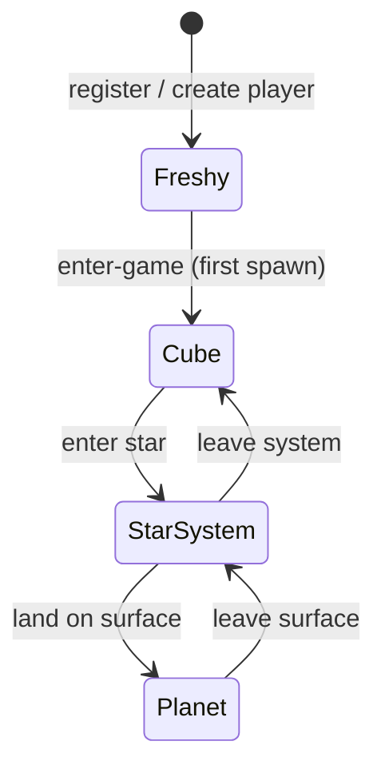

# Player Location

```yaml
date: 2026-06-13
author: Roro LeSage
model: Composer
sources:
  - documentation/wip/player-location/example.json
  - documentation/objects/cube.md
  - documentation/objects/star.md
  - documentation/objects/star-system.md
  - documentation/objects/planet.md
  - documentation/first-planet/first-planet-specifications.md
  - src/modules/players/entities/player.entity.ts
  - src/shared/interfaces/player.interface.ts
  - src/modules/planets/planets.service.ts
  - src/modules/redis/redis.service.ts
```

## Overview

**Player location** describes where a player is in the Infinity coordinate hierarchy at a given moment. It is **contextual**: only the **deepest active view** carries coordinates; parent levels provide **identity only**.

This document is **work in progress**. It defines the target model. The current `Player` entity still uses flat global fields (`galaxyX`, `galaxyY`, `galaxyZ`, `currentPlanetId`, `planetX`, `planetY`) and Redis for planet hex positions — alignment is planned.

| Depth | Client view | Coordinates at this depth |
|-------|-------------|---------------------------|
| Cube | Galaxy View | Local 3D position inside the cube |
| Star system | Solar System View (`solaris`) | Local 2D position in the system map |
| Planet | Planetary View (`terra-view`) | Axial hex `(q, r)` on the surface |

Examples: [example.json](./example.json).

---

## Fresh player (`freshy`)

A player with **no location** — `location` is **`null`** or **absent** — is a **`freshy`**: authenticated (has a `Player` record) but **not yet placed in the game world**.

| State | `location` | Meaning |
|-------|------------|---------|
| **Freshy** | `null` / absent | Never spawned; no cube, system, or planet context |
| **In world** | one of the three depth shapes below | Has entered the galaxy at least once |

**Freshy** is the default after account registration. The player becomes **in world** after the first successful world bootstrap (today: `POST /infinity/players/me/enter-game`; target: persist a full `location` object).

Until then, clients should treat a freshy as having **no navigable position** — redirect to spawn / enter-game flow rather than Galaxy, Solaris, or Terra View.

**Current implementation (interim):** `currentPlanetId === null` on the flat `Player` entity is the practical freshy signal. After alignment, **`location == null`** replaces that check.

---

## Core rule

**Location depth** = the view the player is actively in.

- Coordinates exist **only** at the current depth.
- **`cube.id` is always required** whenever a `cube` object is present.
- Deeper levels **omit** parent coordinates.
- Shallow levels **omit** child objects entirely when not entered.

---

## Coordinate spaces

### Cube — local 3D

When the player is at **cube depth**, `cube.position` is **local to the cube volume**, not global galaxy coordinates.

Same convention as [star `local_coords`](../objects/star.md):

| Property | Value |
|----------|-------|
| Origin | Cube **minimum corner** (`cube.origin − 5` on each axis) |
| Range | Each axis in **`[0, 10)`** light-years |
| Global (derived) | minimum corner + local position |

### Star system — local 2D

When the player is at **star-system depth**, `starSystem.position` is a 2D point in the **system map** — the same space as `StarSystem.planets[].x` / `y`. See [star-system.md](../objects/star-system.md).

### Planet — axial hex

When the player is at **planet depth**, `planet.hex_coords` uses axial coordinates `{ q, r }` on the toroidal surface grid. See [planet.md](../objects/planet.md) and [hexagonal-planet-specification.md](../planets/hexagonal-planet-specification.md).

---

## Location by depth

### On a planet

**Required**

| Field | Description |
|-------|-------------|
| `cube.id` | Parent cube UUID |
| `starSystem.id` | Parent star / system UUID (same as `Star.id`) |
| `planet.id` | Planet identifier — `{starId}_planet_{index}` |
| `planet.hex_coords` | Surface position `{ q, r }` |

**Not allowed**

- `cube.position`
- `starSystem.position`

```json
{
  "location": {
    "cube": { "id": "550e8400-e29b-41d4-a716-446655440000" },
    "starSystem": { "id": "661e8400-e29b-41d4-a716-446655440001" },
    "planet": {
      "id": "661e8400-e29b-41d4-a716-446655440001_planet_0",
      "hex_coords": { "q": 4, "r": 7 }
    }
  }
}
```

### In a star system (not on a planet)

**Required**

| Field | Description |
|-------|-------------|
| `cube.id` | Parent cube UUID |
| `starSystem.id` | Star / system UUID |
| `starSystem.position` | Local 2D `{ x, y }` in the system map |

**Not allowed**

- `planet` (field absent)
- `cube.position`

```json
{
  "location": {
    "cube": { "id": "550e8400-e29b-41d4-a716-446655440000" },
    "starSystem": {
      "id": "661e8400-e29b-41d4-a716-446655440001",
      "position": { "x": 145.2, "y": 34.8 }
    }
  }
}
```

### In a cube only (not in a star system)

**Required**

| Field | Description |
|-------|-------------|
| `cube.id` | Cube UUID |
| `cube.position` | Local 3D `{ x, y, z }` inside the cube |

**Not allowed**

- `starSystem` (field absent)
- `planet` (field absent)

```json
{
  "location": {
    "cube": {
      "id": "550e8400-e29b-41d4-a716-446655440000",
      "position": { "x": 2.1, "y": 3.4, "z": 5.6 }
    }
  }
}
```

---

## Summary table

| Player context | `location` | `cube` | `starSystem` | `planet` |
|----------------|------------|--------|--------------|----------|
| **Freshy** | `null` | — | — | — |
| On planet | object | `id` only | `id` only | `id` + `hex_coords` |
| In star system | object | `id` only | `id` + `position` | — |
| In cube | object | `id` + `position` (local 3D) | — | — |

---

## Invariants

1. **`location` is either `null` (freshy) or exactly one of the three depth shapes** — never a partial or empty object.
2. **`cube.id` is mandatory** at every depth where `cube` appears.
3. If `planet` is present → `starSystem.id` and `cube.id` must be present; neither parent carries coordinates.
4. If `starSystem` is present without `planet` → `starSystem.position` is required; `cube` has `id` only.
5. If only `cube` is present → `cube.position` is required (local 3D); no `starSystem` or `planet`.
6. `starSystem.id` equals the parent [star](../objects/star.md) UUID and [star-system](../objects/star-system.md) `_id`.
7. `planet.id` must belong to the given `starSystem.id` (`planet.starSystemId`).

---

## View transitions

Entering a deeper level **drops** coordinates at the level being left and **sets** coordinates only at the new deepest level.



**Freshy** has no `location`. The first successful enter-game sets `location` to **cube depth** (or **planet depth** if spawn lands directly on a surface — see first-planet flow).

| Transition | Coordinates cleared | Coordinates set |
|------------|--------------------|-----------------|
| Cube → star system | `cube.position` | `starSystem.position` |
| Star system → planet | `starSystem.position` | `planet.hex_coords` |
| Planet → star system | `planet` (removed) | `starSystem.position` |
| Star system → cube | `starSystem` (removed) | `cube.position` |

---

## Storage

**Implemented (2026-06-13).** Player location is stored **only in PostgreSQL**. **No Redis** for location or position.

### PostgreSQL — single source of truth

| Column | Type | Description |
|--------|------|-------------|
| `location` | **`JSONB`** | Full location object (see shapes below), or **`NULL`** for a **freshy** |

The JSONB payload matches the API shape: one of the three depth objects from [Location by depth](#location-by-depth), never a partial tree.

**Replaces** (on alignment): flat columns `galaxyX`, `galaxyY`, `galaxyZ`, `currentPlanetId`, `planetX`, `planetY`.

### Write policy — flush on every move

Every position change **updates `Player.location` immediately** in PostgreSQL. There is no separate hot cache.

| Event | `location` update |
|-------|-------------------|
| First spawn (`enter-game`) | Set full object (typically **planet depth** for first-planet flow) |
| View transition | Replace shape; clear parent coords per [View transitions](#view-transitions) |
| `GALAXY_MOVE` (cube depth) | Update `cube.position` |
| System map move (star-system depth) | Update `starSystem.position` |
| `PLANET_MOVE` (planet depth) | Update `planet.hex_coords` |
| `PLANET_JOIN` | Read/write `location` from PostgreSQL only (no Redis fallback) |

Socket broadcasts (`GALAXY_UPDATE`, `PLANET_UPDATE`, etc.) remain for real-time display; **persistence always goes through JSONB** on the same code path as the move handler.

### Redis — not used

Planet position Redis keys (`planet:position:*`) were **removed** on alignment. Revisit Redis only if planet or system multiplayer load warrants a hot cache — not part of the current target.

### Enter-game response

**Decided.** `POST /infinity/players/me/enter-game` returns a **slim payload**:

```json
{
  "player": {
    "id": "…",
    "userId": "…",
    "location": {
      "cube": { "id": "…" },
      "starSystem": { "id": "…" },
      "planet": {
        "id": "661e8400-e29b-41d4-a716-446655440001_planet_0",
        "hex_coords": { "q": 4, "r": 7 }
      }
    }
  }
}
```

**`location.planet.id`** is the primary handoff for **Terra View**. The client loads planet surface, star system, and cube context via existing REST (`GET /planets/:planetId`, etc.) — not embedded in the enter-game response.

Freshy before spawn: `{ "player": { "id": "…", "userId": "…", "location": null } }`.

---

## Gap vs current implementation

**Aligned (2026-06-13).** The server implements this spec: JSONB `Player.location`, freshy when `null`, PostgreSQL flush on every move, no Redis for position. See [development-plan.md](./development-plan.md) phases 0–6.

| Target (this spec) | Status |
|--------------------|--------|
| `location == null` → freshy | **Done** |
| `location` JSONB column | **Done** |
| Nested `location` by view depth | **Done** |
| Local `cube.position` at cube depth | **Done** |
| `planet.hex_coords` | **Done** |
| `starSystem.id` + optional `position` | **Done** |
| `cube.id` always present | **Done** |
| PostgreSQL flush on every move | **Done** |
| No Redis for location | **Done** |

---

## Related documents

- [development-plan.md](./development-plan.md) — implementation phases and file touch list
- [example.json](./example.json) — three payload examples (`onPlanet`, `inStarSystem`, `inCube`)
- [Cube](../objects/cube.md) — cube identity, origin, local space
- [Star](../objects/star.md) — star local coordinates inside a cube
- [Star system](../objects/star-system.md) — system map 2D layout
- [Planet](../objects/planet.md) — surface hex grid
- [First planet specifications](../first-planet/first-planet-specifications.md) — spawn flow and current position storage
- [Infinity API](../infinity-api.md) — REST and Socket.IO endpoints
