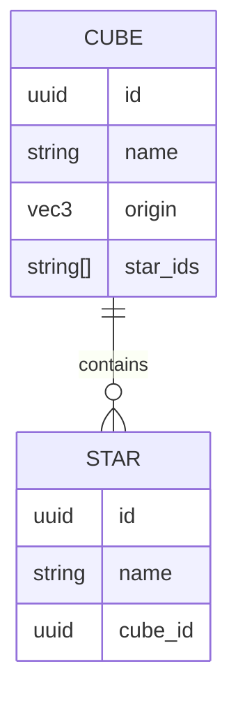

# Cube

```yaml
date: 2026-06-09
author: Roro LeSage
model: Composer
sources:
  - src/shared/interfaces/galaxy.interface.ts
  - src/modules/galaxy/entities/cube.schema.ts
  - src/shared/utils/galaxy-generation.ts
  - documentation/galaxy/cube-based-star-system.md
  - documentation/galaxy/cube-naming-specification.md
```

## Overview

A **cube** is a 10 LY × 10 LY × 10 LY section of the galaxy. Cubes are generated on demand when a client requests a grid-aligned center coordinate. Each cube holds between **5 and 20** [stars](./star.md).

Cubes are stored in MongoDB (`cubes` collection) and cached in Redis as part of a `{ cube, stars }` payload (TTL 120 s).

---

## Identity

| Field | Type | Description |
|-------|------|-------------|
| `id` | UUID v4 | Primary key. Assigned at generation time. |
| `name` | string | Deterministic hash label from `origin` (CRC32 + Base36, lowercase). See [cube-naming-specification.md](../galaxy/cube-naming-specification.md). |
| `origin` | `{ x, y, z }` | Global position of the **cube center** in light-years. Each axis must be a multiple of **10**. |

Examples:

| `origin` | `name` |
|----------|--------|
| `(0, 0, 0)` | `1elvszz` |
| `(10, 10, 10)` | `kikyhk` |
| `(10, -10, 0)` | `1gqdbp2` |

---

## Fields

| Field | Type | Required | Description |
|-------|------|----------|-------------|
| `id` | string (UUID) | yes | Unique cube identifier |
| `name` | string | yes | Hash-based label; unique across cubes |
| `origin` | Vec3 | yes | Cube center in global LY; unique (compound index on `x`, `y`, `z`) |
| `star_ids` | string[] | yes | UUIDs of stars in this cube (denormalized; see note below) |

### Spatial extent

**Edge length:** **10 LY** per axis (`CUBE_SIZE_LY`). Half-edge = **5 LY** (`CUBE_HALF_LY`).

For a cube centered at `origin`:

- **Minimum corner:** `origin − 5` on each axis
- **Extent:** `[origin − 5, origin + 5)` per axis (half-open interval) — 10 LY wide on each axis

Example: `origin (10, 10, 10)` → minimum corner `(5, 5, 5)`, volume spans `[5, 15)` on each axis.

---

## API representation

REST and WebSocket responses expose `id` (MongoDB `_id` is mapped to `id`).

```json
{
  "id": "550e8400-e29b-41d4-a716-446655440000",
  "name": "kikyhk",
  "origin": { "x": 10, "y": 10, "z": 10 },
  "star_ids": [
    "661e8400-e29b-41d4-a716-446655440001",
    "662e8400-e29b-41d4-a716-446655440002"
  ]
}
```

Bundled with stars as `CubeWithStars`:

```json
{
  "cube": { "id": "…", "name": "kikyhk", "origin": { "x": 10, "y": 10, "z": 10 }, "star_ids": ["…"] },
  "stars": [ … ]
}
```

---

## MongoDB document

Collection: **`cubes`**

```json
{
  "_id": "550e8400-e29b-41d4-a716-446655440000",
  "name": "kikyhk",
  "origin": { "x": 10, "y": 10, "z": 10 },
  "star_ids": ["661e8400-e29b-41d4-a716-446655440001"],
  "createdAt": "2026-06-09T12:00:00.000Z",
  "updatedAt": "2026-06-09T12:00:00.000Z"
}
```

| Index | Purpose |
|-------|---------|
| `_id` | Unique (cube UUID) |
| `name` | Unique lookup by hash name |
| `origin.x`, `origin.y`, `origin.z` | Unique spatial lookup |

---

## Relationships



- A cube **owns** many stars via `stars.cube_id`.
- `star_ids` on the cube is a denormalized list of star UUIDs. When loading a cube, the server reads stars from the **`stars` collection** by `cube_id`; `star_ids` is not used for hydration.

---

## Generation rules

- Triggered by `CubeService.getOrCreateByOrigin()` when no cube exists for the given `origin`.
- `name` is **deterministic** from `origin`.
- `id` is a **random UUID v4**.
- Star count, positions, and types are **random** on first generation; persisted results are returned on later requests for the same `origin`.

---

## Related endpoints

| Method | Path | Behavior |
|--------|------|----------|
| `GET` | `/infinity/cubes/:x/:y/:z` | Find or create cube + stars (JWT) |
| `GET` | `/infinity/cubes/:x/:y/:z/stars` | Find or create cube; return stars only (JWT) |
| `GET` | `/infinity/cubes/by-name/:name` | Lookup by `name`; does **not** generate (JWT) |

WebSocket: `REQUEST_CUBE` → `CUBE_DATA` (same `{ cube, stars }` shape). See [infinity-api.md](../infinity-api.md).

---

## Related documents

- [star.md](./star.md) — star object
- [cube-based-star-system.md](../galaxy/cube-based-star-system.md) — coordinate system and galaxy layout
- [cube-naming-specification.md](../galaxy/cube-naming-specification.md) — `name` algorithm
