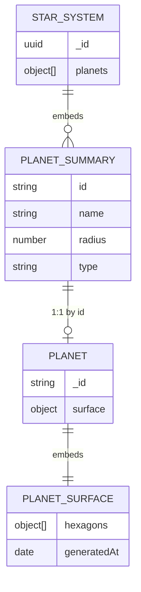

# Planet

```yaml
date: 2026-06-11
author: Roro LeSage
model: Composer
sources:
  - src/modules/planets/entities/planet.schema.ts
  - src/modules/planets/planets.service.ts
  - src/shared/interfaces/planet.interface.ts
  - src/shared/utils/planet-surface-generation.ts
  - src/shared/utils/planet-naming.ts
  - src/shared/constants/game.constants.ts
  - documentation/objects/star-system.md
  - documentation/planets/hexagonal-planet-specification.md
```

## Overview

A **planet** (MongoDB class **`Planet`**) is the **detailed surface document** for a **landable** world in a parent [star system](./star-system.md). It combines **inherited** fields from the matching `StarSystem.planets[]` summary with a generated **toroidal hex grid** nested as **`surface`**.

- Created on **first player entry** via `GET /infinity/planets/:planetId?systemId={starId}`.
- **Gas planets** never get a `Planet` document — entry returns **422**.
- Document existence means the planet was entered; there is no `visited` flag on `Planet` (`StarSystem.visited` is separate).
- Real-time movement uses Socket.IO (`PLANET_JOIN`, `PLANET_MOVE`) with positions cached in **Redis**.

---

## Identity

| Field | Type | Description |
|-------|------|-------------|
| `_id` | string | Primary key. **Same value** as `StarSystem.planets[].id` — format `{starId}_planet_{index}`. |

Procedural generation uses **`_id`** as the surface seed (no separate `seed` field).

---

## Fields

### Planet

| Field | Type | Required | Source | Description |
|-------|------|----------|--------|-------------|
| `_id` | string | yes | Inherited | Same as summary `planets[].id` |
| `name` | string | yes | Inherited | Same as summary `planets[].name` |
| `starSystemId` | string (UUID) | yes | Inherited | Parent `StarSystem._id` |
| `type` | string | yes | Inherited | `rocky`, `gas`, `ice`, or `lava` (only landable types are persisted) |
| `radius` | number | yes | Inherited | Hex grid edge length — **odd integer** from **5** to **15** |
| `resources` | Record<string, number> | yes | Inherited | Summary quantities from `planets[].resources` |
| `surface` | object | yes | Generated | Nested **`PlanetSurface`** (hex layer) |
| `createdAt` / `updatedAt` | Date | automatic | Mongoose | Timestamps |

**Not on `Planet`:** `distanceFromStar` (orbital distance on star-system summary only), `visited`, `seed`, `heightMap`, `tileMap`, `biomeTypes`.

### PlanetSurface (`surface`)

| Field | Type | Description |
|-------|------|-------------|
| `hexagons` | object[] | Flat list of **`radius × (radius + 1)`** hex cells |
| `generatedAt` | Date | Timestamp of first surface generation |

### Hexagon (`surface.hexagons[]`)

| Field | Type | Description |
|-------|------|-------------|
| `biome` | string | `desert`, `forest`, `ocean`, `mountain`, `ice`, or `volcanic` |
| `resources` | object[] | Per-hex deposits — **`[]` in current MVP** |
| `dangerLevel` | number | Integer **0–10** |
| `coordinates.q` | number | Axial coordinate; `0 ≤ q < radius` |
| `coordinates.r` | number | Axial coordinate; `0 ≤ r < radius + 1` |

### Toroidal grid

Neighbor lookup wraps `q` with `% radius` and `r` with `% (radius + 1)`. Server and client must use the same `getNeighbors(q, r, radius)` logic for movement display. See [hexagonal-planet-specification.md](../planets/hexagonal-planet-specification.md).

---

## API representation

Returned by `GET /infinity/planets/:planetId` as the **Mongoose document** shape (`_id`, not `id`).

```json
{
  "_id": "661e8400-e29b-41d4-a716-446655440001_planet_0",
  "name": "Alpha CesLufTop I",
  "starSystemId": "661e8400-e29b-41d4-a716-446655440001",
  "type": "rocky",
  "radius": 5,
  "resources": {
    "iron": 420,
    "gold": 75,
    "water": 1300
  },
  "surface": {
    "hexagons": [
      {
        "biome": "desert",
        "resources": [],
        "dangerLevel": 3,
        "coordinates": { "q": 0, "r": 0 }
      }
    ],
    "generatedAt": "2026-06-11T12:00:00.000Z"
  },
  "createdAt": "2026-06-11T12:00:00.000Z",
  "updatedAt": "2026-06-11T12:00:00.000Z"
}
```

The example shows **one** hex; a full surface has **`radius × (radius + 1)`** entries (30 when `radius` is 5).

---

## MongoDB document

Collection: **`planets`** (Mongoose model `Planet`)

| Index | Purpose |
|-------|---------|
| `_id` | Unique (same string as summary `planets[].id`) |

Once saved, the same `_id` always returns the same document — **no regeneration** on reload.

---

## Relationships



| Related object | Relationship |
|----------------|--------------|
| [Star system](./star-system.md) | Parent. Summary in `planets[]`; `starSystemId` = `StarSystem._id`. |
| **Planet summary** | Lightweight `planets[]` entry — source of truth for inherited fields. |
| **Redis position** | Ephemeral player hex `(q, r)` per socket id — not on the MongoDB document. |

---

## Lifecycle

1. Player enters a star → `GET /infinity/galaxy/systems/:systemId` loads `StarSystem.planets[]`.
2. Player selects a **landable** planet → `GET /infinity/planets/:planetId?systemId={starId}`.
3. If **`type` is `gas`** → **422**; no `Planet` document.
4. If landable and no document exists → copy inherited fields; generate `surface`; save.
5. Subsequent `GET` returns the saved document (`systemId` optional on reload).
6. Client connects Socket.IO → `PLANET_JOIN` → random spawn or Redis restore → `PLANET_MOVE` updates Redis.

---

## Generation rules

Handled by `PlanetsService` and `generatePlanetSurface()` in `planet-surface-generation.ts`.

### Inherited fields

Copied from the matching `StarSystem.planets[]` entry — **not** re-rolled:

| Field | Rule |
|-------|------|
| `_id` | `planets[].id` |
| `name` | `planets[].name` |
| `starSystemId` | `StarSystem._id` |
| `type` | `planets[].type` |
| `radius` | `planets[].radius` (odd integer 5–15 from star-system generator) |
| `resources` | `planets[].resources` |

### PlanetSurface (hex layer)

| Generated value | Rule |
|-----------------|------|
| Grid size | `radius × (radius + 1)` cells |
| `hexagons[].biome` | Random from `HEX_BIOMES` (seeded by `_id`) — band-based rules deferred |
| `hexagons[].dangerLevel` | Random **0–10** (seeded by `_id`) |
| `hexagons[].resources` | Always **`[]`** in MVP |
| `generatedAt` | Set on first generation |
| Topology | Toroidal wrap via `getNeighbors` |

**Determinism:** first-time generation is seeded by `_id` and stable after MongoDB save. The document is never regenerated.

---

## Related endpoints

### REST

| Method | Path | Auth | Behavior |
|--------|------|------|----------|
| `GET` | `/infinity/galaxy/systems/:systemId` | JWT | Load star system with planet summaries (prerequisite) |
| `GET` | `/infinity/planets/:planetId` | Public | Get or generate `Planet`; `?systemId=` **required on first entry** |

**Error responses** for planet entry:

| Status | Condition |
|--------|-----------|
| `400 Bad Request` | First entry without `systemId` |
| `404 Not Found` | `planetId` not in `StarSystem.planets[]` |
| `422 Unprocessable Entity` | Summary `type` is `gas` |

### WebSocket

| Event | Direction | Notes |
|-------|-----------|-------|
| `PLANET_JOIN` | Client → server | Join room `planetId`; spawn or restore `(q, r)` from Redis |
| `PLANET_LEAVE` | Client → server | Leave room; Redis position kept |
| `PLANET_MOVE` | Client → server | Update `(q, r)` — all moves valid in MVP |
| `PLANET_UPDATE` | Server → client | `{ playerId, planetId, q, r }` |
| `PLANET_ERROR` | Server → client | Handler errors |

See [infinity-api.md](../infinity-api.md) for full request/response details.

---

## Related documents

- [star-system.md](./star-system.md) — parent system and planet summaries
- [star.md](./star.md) — grandparent star (galaxy map layer)
- [hexagonal-planet-specification.md](../planets/hexagonal-planet-specification.md) — full hex surface specification
- [development-plan.md](../planets/development-plan.md) — implementation phases and test plan
- [infinity-api.md](../infinity-api.md) — REST and Socket.IO reference
