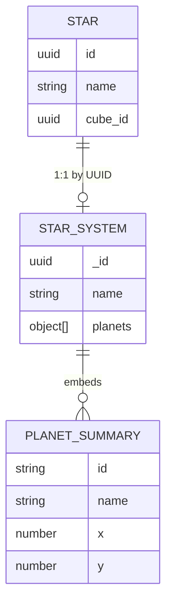

# Star System

```yaml
date: 2026-06-10
author: Roro LeSage
model: Composer
sources:
  - src/modules/galaxy/entities/star-system.schema.ts
  - src/shared/interfaces/star-system.interface.ts
  - src/modules/galaxy/star-system.service.ts
  - src/modules/galaxy/galaxy.controller.ts
  - src/shared/utils/procedural-generation.ts
  - documentation/stellar-system/stellar-system-summary.md
  - documentation/objects/star.md
  - documentation/objects/cube.md
```

## Overview

A **star system** (MongoDB class **`StarSystem`**) is the **on-demand inner view** of a parent [star](./star.md): embedded planet summaries and local 2D layout. It is **not** part of the cube payload and is **not** stored on the cube.

Star systems are created when a player **enters** a star (`GET /infinity/galaxy/systems/:systemId`). The parent **star stays in the cube**; the system is a separate document keyed by the same UUID.

---

## Identity

| Field | Type | Description |
|-------|------|-------------|
| `_id` | UUID v4 | Primary key. **Same UUID** as the parent `Star.id`. |
| `name` | string | Display label. **Same string** as the parent `Star.name` (e.g. `Alpha kikyhk`). |

A **star must exist** in the `stars` collection before a star system can be created. Unknown star UUIDs return **404** — no system is generated.

---

## Fields

| Field | Type | Required | Description |
|-------|------|----------|-------------|
| `_id` | string (UUID) | yes | Same as parent `Star.id` |
| `name` | string | yes | Same as parent `Star.name` |
| `planets` | object[] | yes | Lightweight planet summaries (see below) |
| `visited` | boolean | no | `true` after first generation or entry |
| `createdAt` / `updatedAt` | Date | automatic | Mongoose timestamps |

There is **no** embedded `stars[]` field. Load the parent star separately via `GET /infinity/stars/:id` when the galaxy-map view is needed.

### Planet summary (`planets[]`)

| Field | Type | Description |
|-------|------|-------------|
| `id` | string | `{starId}_planet_{index}` — links to detailed `Planet` documents |
| `name` | string | Display name (e.g. `Planet 1`) |
| `x`, `y` | number | Local 2D position in the system view |
| `radius` | number | Planet radius |
| `type` | string | `rocky`, `gas`, `ice`, or `lava` |
| `resources` | Record<string, number> | Summary quantities (`iron`, `gold`, `water`, …) |

---

## API representation

Unlike [cube](./cube.md) and [star](./star.md) responses, the enter-star endpoint returns the **Mongoose document** shape (`_id`, not `id`).

```json
{
  "_id": "661e8400-e29b-41d4-a716-446655440001",
  "name": "Alpha kikyhk",
  "planets": [
    {
      "id": "661e8400-e29b-41d4-a716-446655440001_planet_0",
      "name": "Planet 1",
      "x": 145.2,
      "y": 34.8,
      "radius": 11.4,
      "type": "rocky",
      "resources": { "iron": 420, "gold": 75, "water": 1300 }
    }
  ],
  "visited": true,
  "createdAt": "2026-06-10T18:00:00.000Z",
  "updatedAt": "2026-06-10T18:00:00.000Z"
}
```

Use **`_id`** (star UUID) for system lookups. Use **`name`** for display in the client UI.

---

## MongoDB document

Collection: **`starsystems`** (Mongoose default for model `StarSystem`)

```json
{
  "_id": "661e8400-e29b-41d4-a716-446655440001",
  "name": "Alpha kikyhk",
  "planets": [],
  "visited": true,
  "createdAt": "2026-06-10T18:00:00.000Z",
  "updatedAt": "2026-06-10T18:00:00.000Z"
}
```

| Index | Purpose |
|-------|---------|
| `_id` | Unique (same UUID as parent star) |

---

## Relationships



| Related object | Relationship |
|----------------|--------------|
| [Star](./star.md) | **Required** parent. **1:1** by `_id` / `id` and `name`. Star is never removed from the cube on entry. |
| [Cube](./cube.md) | Indirect via parent star (`Star.cube_id`). Cubes hold **stars only** — not star systems. |
| **Planet** | Summaries embedded in `planets[]`. Full surface data via `GET /infinity/planets/:planetId`. Pass `?systemId={starUuid}` on first load so `Planet.starSystemId` equals the parent star UUID. |

---

## Lifecycle

1. A cube is explored → lightweight [stars](./star.md) are persisted in `stars`.
2. Map view uses **cube + stars** only; no `StarSystem` yet.
3. Player enters a star → `GET /infinity/galaxy/systems/:systemId` (value = star UUID).
4. `StarSystemService` verifies the **Star** exists (**404** if not).
5. If a **StarSystem** exists → return it. If not → generate, save, return.
6. Cube star unchanged; system holds **planets** and local layout.

---

## Generation rules

First-time generation is handled by `StarSystemService.generateStarSystem()` and `generateStarSystem({ seed })` in `procedural-generation.ts`.

| Rule | Behavior |
|------|----------|
| Seed | Parent star UUID (`starId`) |
| Star properties | **Do not** alter planet layout (spectral type, cube context unchanged) |
| Determinism | **Non-deterministic** on first build (`Math.random()`); stable after MongoDB save |
| `_id` / `name` | Set from parent `Star` on save (generator default name is overridden) |

### Formulas

| Generated value | Rule in code |
|-----------------|--------------|
| Planet count | `Math.floor(noise.perlin2(1, 0) * 5) + 3` |
| Planet id | `{seed}_planet_{index}` |
| Planet name | `Planet {index + 1}` |
| Planet position | Random angle; distance `100 + noise.perlin2(index, 1) * 50` from center `(0, 0)` |
| Planet radius | `5 + Math.random() * 10` |
| Planet type | Random `rocky`, `gas`, `ice`, `lava` |
| Planet resources | `iron`, `gold`, `water` via `Math.floor(Math.random() * max)` |

With the current `noisejs` dependency, integer Perlin coordinates return `0`, so the effective layout is **3 planets** at orbit distance **100** from center; types, radius, resources, and orbit angles vary per run.

---

## Related endpoints

| Method | Path | Auth | Behavior |
|--------|------|------|----------|
| `GET` | `/infinity/galaxy/systems/:systemId` | JWT | Get or generate star system (`systemId` = parent `Star.id`) |
| `GET` | `/infinity/stars/:id` | JWT | Load parent star for map view |
| `GET` | `/infinity/planets/:planetId` | Public | Detailed planet surface; pass `?systemId={starUuid}` on first generation |

**Error responses** for enter-star:

| Status | Condition |
|--------|-----------|
| `401 Unauthorized` | Missing or invalid JWT |
| `404 Not Found` | Star not found (no system generated) |

See [infinity-api.md](../infinity-api.md) for full request/response details.

---

## Related documents

- [star.md](./star.md) — parent star object (galaxy map layer)
- [cube.md](./cube.md) — parent cube (contains stars only)
- [Stellar System Summary](../stellar-system/stellar-system-summary.md) — domain reference and migration notes
- [Stellar System index](../stellar-system/README.md) — implementation status and audit
- [infinity-api.md](../infinity-api.md) — REST and WebSocket reference
