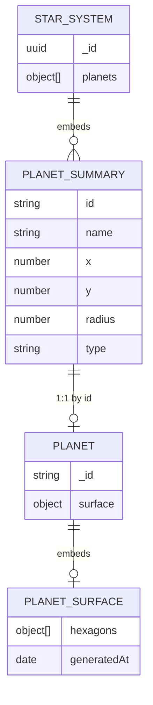

# Hexagonal Planet Surface Specification

```yaml
date: 2026-06-11
author: Roro LeSage
model: Composer
sources:
  - documentation/objects/star-system.md
  - documentation/planets/planet-details-review.md
  - documentation/infinity-api.md
  - src/modules/planets/entities/planet.schema.ts
```

---

## Status

**Implemented** — REST + MongoDB hex surface (Phases 1–5) and Socket.IO planet movement with Redis positions (Phase 6).

The `Planet` Mongoose schema uses a nested **`surface.hexagons[]`** toroidal hex grid. See [infinity-api.md](../infinity-api.md) for the live `GET /infinity/planets/:planetId` contract.

---

## Overview

When a player enters a **landable** planet, the server creates or loads a **`Planet`** document in the `planets` collection. The walkable **hex layer** is modeled as **`PlanetSurface`** (nested on `Planet.surface`).

- Grid size equals the planet **`radius`** inherited from the [star-system](../objects/star-system.md) planet summary.
- **`radius` must be an odd integer** (e.g. `5` → 25 hex cells in a 5×5 axial region).
- Each hex has a **biome**, **resources**, and a **danger level**.
- Coordinates use **axial** `(q, r)`; edges wrap with modulo arithmetic → **torus** topology.
- **Gas planets** have no surface; players cannot enter them.

Summary fields on **`Planet`** are **inherited** from the star-system summary. Only **`PlanetSurface`** (hex grid) is generated on first entry.

### Naming

| Name | Meaning |
|------|---------|
| **Planet summary** | Lightweight entry in `StarSystem.planets[]` |
| **Planet** | Full MongoDB document — inherited identity + optional surface |
| **PlanetSurface** | Generated toroidal hex grid (`hexagons`, `generatedAt`) — **this spec’s subject** |
| ~~PlanetDetails~~ | Retired name — too vague; use **Planet** + **PlanetSurface** instead |

---

## Relationships



| Object | Role |
|--------|------|
| [StarSystem](../objects/star-system.md) | Holds lightweight `planets[]` summaries and orbital layout (`x`, `y`). Created on star entry. |
| **Planet summary** | One entry in `StarSystem.planets[]`. Source of truth for id, name, type, radius, summary resources. |
| **Planet** | Full document in the `planets` collection. Same `_id` as summary `id`. Created on first planet entry (landable types only). |
| **PlanetSurface** | Nested **`Planet.surface`** — toroidal hex grid generated once, stable after save. |

**Lifecycle**

1. Player enters a star → `StarSystem` is loaded or generated with `planets[]` summaries.
2. Player selects a planet → client calls `GET /infinity/planets/:planetId?systemId={starId}` (planned shape).
3. If `type` is **`gas`** → reject entry; no **`Planet`** document is created.
4. If landable → copy inherited fields from the matching summary; generate **`PlanetSurface`**; save **`Planet`** document.
5. Subsequent loads return the saved **`Planet`** unchanged (**stable after save**).

---

## Identity

| Field | Type | Description |
|-------|------|-------------|
| `_id` | string | Same as `StarSystem.planets[].id` — format `{starId}_planet_{index}` |

---

## Fields

### Planet

MongoDB document combining **inherited** summary fields and an optional **`surface`**.

```typescript
interface Planet {
  // Inherited from StarSystem.planets[] (and starSystemId from StarSystem._id)
  _id: string;
  name: string;
  starSystemId: string;
  type: 'rocky' | 'gas' | 'ice' | 'lava';
  radius: number;
  resources: Record<string, number>;

  // Generated on first entry (landable types only)
  surface: PlanetSurface;
}
```

| Field | Source | Notes |
|-------|--------|-------|
| `_id` | Inherited | Same as `planets[].id` |
| `name` | Inherited | Same as `planets[].name` (e.g. `Planet 1`) |
| `starSystemId` | Inherited | Same as `StarSystem._id` (parent star UUID) |
| `type` | Inherited | Same as `planets[].type` — **not** re-rolled at generation |
| `radius` | Inherited | Same as `planets[].radius`. **Odd integer** — hex grid edge length N; N×N cells |
| `resources` | Inherited | Same as `planets[].resources` — summary quantities |
| `surface` | Generated | **`PlanetSurface`** — absent when `type` is `gas` (no document created) |

**Not on Planet**

| Field | Where it lives |
|-------|----------------|
| `x`, `y` | Star-system summary only (orbital layout) |
| `distanceToStar`, `planetNumber`, `position` | Not used in this model |
| `hexGridSize` | Not a separate field — use `radius` |
| `visited` | Not on `Planet` — a saved document implies first entry; `StarSystem.visited` is separate |

### PlanetSurface

The **walkable hex layer** — subject of this specification.

```typescript
interface PlanetSurface {
  hexagons: Hexagon[];
  generatedAt: Date;
}
```

| Field | Source | Notes |
|-------|--------|-------|
| `hexagons` | Generated | Flat list of **`radius × radius`** cells |
| `generatedAt` | Generated | Timestamp of first surface generation |

### Hexagon

```typescript
interface Hexagon {
  biome: 'desert' | 'forest' | 'ocean' | 'mountain' | 'ice' | 'volcanic';
  resources: Array<{
    type: string;
    abundance: number; // 0–100
    rarity: 'common' | 'rare' | 'epic' | 'legendary';
  }>;
  dangerLevel: number; // 0–10
  coordinates: { q: number; r: number };
}
```

| Field | Description |
|-------|-------------|
| `biome` | Cell biome. Includes `ocean` as a **cell** type (not a planet `type`). |
| `resources` | Deposits on this hex (see [Resources](#resources)). |
| `dangerLevel` | Local threat level for gameplay. |
| `coordinates.q`, `coordinates.r` | Axial coordinates; `0 ≤ q, r < radius`. |

---

## Hexagonal grid

### Coordinate system

- The surface is an **N×N axial region** with **N = `radius`**.
- Each pair `(q, r)` with `0 ≤ q < radius` and `0 ≤ r < radius` is one hex cell.
- Total cells: **`radius × radius`**.
- In flat rendering this region is a **parallelogram** in hex space, not a visually square patch; topology follows axial rules below.

**Odd `radius`**

`radius` must be an odd integer so the grid has a unique geometric center cell:

```text
center = (radius - 1) / 2   // e.g. radius 5 → center 2 → cell (2, 2)
```

Star-system generation must assign **odd integer** `radius` values for landable planets (see [star-system.md](../objects/star-system.md) — current examples may still show fractional values until generation is updated).

### Toroidal topology

Neighbor lookup wraps both axes with **`% radius`**. This defines a **torus**:

- Example: **`radius = 3`** → 3×3 region, **9 hexagons**. Moving off the left edge at `(0, r)` wraps to `(2, r)`; moving off the top at `(q, 0)` wraps to `(q, 2)`.
- Every cell has **six neighbors**, including edge cells.
- When drawing the grid **flat**, wrapped neighbors may not look adjacent; server and client must use the same `getNeighbors` function for movement and pathfinding.

### Neighbor directions

| Direction | Offset from `(q, r)` |
|-----------|----------------------|
| Top-Left | `(q−1, r+1)` |
| Top-Right | `(q, r+1)` |
| Right | `(q+1, r)` |
| Bottom-Right | `(q+1, r−1)` |
| Bottom-Left | `(q, r−1)` |
| Left | `(q−1, r)` |

### `getNeighbors`

```typescript
function getNeighbors(
  q: number,
  r: number,
  radius: number,
): { q: number; r: number }[] {
  const n = radius;
  return [
    { q: (q - 1 + n) % n, r: (r + 1) % n },
    { q: q, r: (r + 1) % n },
    { q: (q + 1) % n, r: r },
    { q: (q + 1) % n, r: (r - 1 + n) % n },
    { q: q, r: (r - 1 + n) % n },
    { q: (q - 1 + n) % n, r: r },
  ];
}
```

### Neighbor examples

**`radius = 3`** — neighbors of `(0, 0)`:

| Direction | Coordinates |
|-----------|-------------|
| Top-Left | (2, 1) |
| Top-Right | (0, 1) |
| Right | (1, 0) |
| Bottom-Right | (1, 2) |
| Bottom-Left | (0, 2) |
| Left | (2, 0) |

**`radius = 5`** — neighbors of `(0, 0)`:

| Direction | Coordinates |
|-----------|-------------|
| Top-Left | (4, 1) |
| Top-Right | (0, 1) |
| Right | (1, 0) |
| Bottom-Right | (1, 4) |
| Bottom-Left | (0, 4) |
| Left | (4, 0) |

---

## Generation rules

### 1. Inherited base attributes

Copy from the matching `StarSystem.planets[]` entry (see [star-system.md](../objects/star-system.md)):

| Field | Rule |
|-------|------|
| `_id` | `planets[].id` |
| `name` | `planets[].name` |
| `starSystemId` | `StarSystem._id` |
| `type` | `planets[].type` — no weighted re-roll |
| `radius` | `planets[].radius` — must already be an odd integer |
| `resources` | `planets[].resources` |

If **`type` is `gas`**: stop here. Do not create a **`Planet`** document. Player entry is blocked.

### 2. Gas planets

| Rule | Behavior |
|------|----------|
| Surface | None — no **`Planet`** document |
| Entry | Player **cannot** enter; client should disable the action |
| API (planned) | `GET /infinity/planets/:planetId` returns **`422 Unprocessable Entity`** (or client avoids the call) |
| Star map | Planet remains visible as a summary only |

### 3. Landable types

Enterable planet types: **`rocky`**, **`ice`**, **`lava`**, plus any future landable types. **`PlanetSurface`** generation runs for these only.

### 4. PlanetSurface generation

For each `(q, r)` with `0 ≤ q, r < radius`, create one `Hexagon` with:

1. **Biome** — from inherited `type` and position (section 5).
2. **Resources** — from biome defaults plus optional extra finds (section 6).
3. **Danger level** — integer `0–10` (random roll allowed).

Store all cells in `surface.hexagons[]` (order not significant; use `coordinates` for lookup).

**Determinism:** **`PlanetSurface`** generation **does not have to be deterministic** — random or noise-based rolls are allowed. Once **`Planet`** is **saved to MongoDB**, it is **not regenerated** on reload.

### 5. Biome assignment

Biomes depend on **inherited planet `type`** and **distance from grid center**. The example below uses Euclidean distance on axial coordinates for radial bands; hex distance on cube coordinates may be adopted later for more regular rings.

| Planet `type` | Typical biomes by zone |
|---------------|------------------------|
| `rocky` | Center: `forest`, `mountain`. Mid: `desert`, `mountain`. Edge: `desert`. |
| `ice` | Center: `ice`, `mountain`. Outer: `ice`. |
| `lava` | `volcanic`, `desert`. |
| `gas` | N/A — no surface |

Cell biomes include **`ocean`** (e.g. water-heavy cells on rocky worlds). There is no planet `type` `oceanic`.

```typescript
function randomPick<T>(candidates: T[]): T {
  return candidates[Math.floor(Math.random() * candidates.length)];
}

function getBiomeForHexagon(
  planetType: 'rocky' | 'gas' | 'ice' | 'lava',
  q: number,
  r: number,
  radius: number,
): Hexagon['biome'] {
  if (planetType === 'gas') {
    throw new Error('Gas planets have no hex surface');
  }

  const center = (radius - 1) / 2;
  const distanceToCenter = Math.sqrt(
    (q - center) ** 2 + (r - center) ** 2,
  );
  const normalizedDistance = distanceToCenter / center;

  if (planetType === 'rocky') {
    if (normalizedDistance < 0.5) return randomPick(['forest', 'mountain']);
    if (normalizedDistance < 1.0) return randomPick(['desert', 'mountain']);
    return 'desert';
  }
  if (planetType === 'ice') {
    if (normalizedDistance < 0.5) return randomPick(['ice', 'mountain']);
    return 'ice';
  }
  return randomPick(['volcanic', 'desert']);
}
```

### 6. Resources

Two levels:

| Level | Field | Role |
|-------|-------|------|
| Planet summary | `Planet.resources` | Inherited `Record<string, number>` from star-system summary |
| Hex cell | `Hexagon.resources[]` | Per-cell deposits with `type`, `abundance`, `rarity` |

**Biome → resources (direction only)**

Each **biome** type predefines a set of resource **types** (e.g. desert → iron, …; forest → wood, …). A hex always includes resources from its biome defaults and may include **additional finds** beyond that predefined set.

Detailed tables (abundance ranges, rarity weights, extra-find rules) are **deferred**. Link to `GET /infinity/resources/planet/:planetId` and separate resource documents is also **deferred**.

### 7. Danger level

Each hex gets `dangerLevel` in **`0–10`**. Random assignment is allowed. Stable after the document is saved.

---

## MongoDB document

Collection: **`planets`**. Shape: inherited fields + nested **`surface`**.

```json
{
  "_id": "661e8400-e29b-41d4-a716-446655440001_planet_0",
  "name": "Planet 1",
  "starSystemId": "661e8400-e29b-41d4-a716-446655440001",
  "type": "rocky",
  "radius": 5,
  "resources": { "iron": 420, "gold": 75, "water": 1300 },
  "surface": {
    "hexagons": [
      {
        "biome": "desert",
        "resources": [],
        "dangerLevel": 5,
        "coordinates": { "q": 0, "r": 0 }
      }
    ],
    "generatedAt": "2026-06-11T00:00:00.000Z"
  }
}
```

The example lists **one** hex inside **`surface.hexagons`**; a full **`PlanetSurface`** contains **`radius × radius`** entries (25 when `radius` is 5).

---

## Example: input summary → output detail

**Star-system planet summary** (input):

```json
{
  "id": "661e8400-e29b-41d4-a716-446655440001_planet_0",
  "name": "Planet 1",
  "x": 145.2,
  "y": 34.8,
  "radius": 5,
  "type": "rocky",
  "resources": { "iron": 420, "gold": 75, "water": 1300 }
}
```

**Planet** (output after first entry) — inherited fields plus nested **`PlanetSurface`**; `x` / `y` stay on the star-system document only.

---

## API and events

### REST (implemented)

Documented in [infinity-api.md](../infinity-api.md).

| Method | Path | Notes |
|--------|------|-------|
| `GET` | `/infinity/planets/:planetId` | Load or generate **`Planet`** with **`PlanetSurface`**. `?systemId={starId}` **required on first entry**. |
| — | Gas planet | **422** — no surface document |
| — | Missing `systemId` on first entry | **400** |
| — | Unknown `planetId` in summary | **404** |

### Socket (implemented)

Documented in [infinity-api.md](../infinity-api.md).

| Event | Notes |
|-------|-------|
| `PLANET_JOIN` / `PLANET_LEAVE` | Join / leave room `planetId` |
| `PLANET_MOVE` / `PLANET_UPDATE` | Hex **`(q, r)`** |
| `PLANET_ERROR` | Handler errors to requesting client |
| Spawn | **Random** `(q, r)` on `PLANET_JOIN` if no Redis position |
| Position cache | `planet:position:{planetId}:{socketId}` in **Redis**; PostgreSQL later |

---

## Migration from tile map (completed)

The legacy tile-map shape (`heightMap`, `tileMap`, `biomeTypes`, `seed`, `visited`) was removed. Greenfield rollout — no migration script (see [development-plan.md](./development-plan.md)).

---

## Deferred / out of scope

- Biome → resource lookup tables and extra-find algorithms
- Perlin noise vs band-based biomes (either allowed)
- Debug grid visualization
- Relationship between hex resources and the separate resources collection

---

## Related documents

- [development-plan.md](./development-plan.md) — implementation phases and test plan
- [planet.md](../objects/planet.md) — planet object document
- [star-system.md](../objects/star-system.md) — planet summaries and inherited fields
- [planet-details-review.md](./planet-details-review.md) — review and code alignment
- [infinity-api.md](../infinity-api.md) — REST and Socket.IO reference
