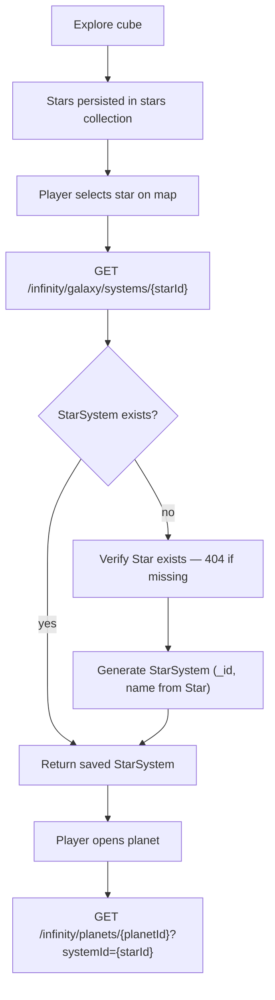

# Infinity - Stellar System Summary

```yaml
date: 2026-06-10
author: Roro LeSage
model: Composer
sources:
  - src/modules/galaxy/entities/star-system.schema.ts
  - src/modules/galaxy/entities/star.schema.ts
  - src/modules/galaxy/star-system.service.ts
  - src/modules/galaxy/galaxy.service.ts
  - src/modules/galaxy/galaxy.controller.ts
  - src/modules/planets/planets.controller.ts
  - src/modules/planets/planets.service.ts
  - src/shared/utils/procedural-generation.ts
  - documentation/objects/star.md
  - documentation/infinity-api.md
```

## Overview

A **stellar system** is the **on-demand** inner view of a cube **[Star](../objects/star.md)**: planets and local layout. It is **not** part of the cube payload.

**Domain rules:**

- **Stars stay in the cube** — lightweight galaxy-map structure (`stars` collection + cube APIs). Entering a star does **not** delete or move the star.
- **Star system is get-or-create** — `GET /infinity/galaxy/systems/:starId` returns a saved `StarSystem` or **generates and persists** one on first access.
- A **star must exist** before a `StarSystem` can be created (implemented: **404** if missing).
- **`StarSystem._id`** and **`StarSystem.name`** match the parent **`Star`**.

See [Two layers](#two-layers) and [Generation rules](#generation-rules).

---

## Terminology

| Term | Meaning |
|------|---------|
| **Cube** | Contains **stars only** (`star_ids`). Stellar systems are not stored on the cube. |
| **Star** | Galaxy-map entity in the `stars` collection (`cube_id`, `local_coords`, `properties`). See [star.md](../objects/star.md). |
| **Stellar system** / **StarSystem** | Inner-layer MongoDB document keyed by the same UUID as the parent star. Holds **planets only** and local layout. **Requires an existing Star.** |
| **`starId`** | Intended name for the route parameter (= `Star.id` = `StarSystem._id`). |
| **Aligned fields** | **`id` / `_id`** (UUID) and **`name`** must match between `Star` and `StarSystem`. |
| **`systemId`** | Parameter name in current NestJS route and legacy docs; same path segment. |

---

## Two layers

| Layer | When | Storage | Client access |
|-------|------|---------|---------------|
| **Galaxy map** | Cube explored | `cubes` + `stars` | `GET /infinity/cubes/...`, `GET /infinity/stars/:id` |
| **Stellar system** | Player enters a star (on demand) | `StarSystem` | `GET /infinity/galaxy/systems/:starId` |

- The **cube keeps its stars** — id, name, `local_coords`, `properties` — for the map at all times.
- The **stellar system** is a **second document**, same UUID as the chosen star, holding planets (and local layout). Created only when needed; reused on subsequent GETs.

---

## Identity

Both **Star** and **StarSystem** expose **`id` / `_id`** (UUID) and **`name`**. Those two fields are **aligned** — copied from the cube star when the system is first created.

| Field | Value |
|-------|-------|
| `_id` / `id` | Same UUID as `Star.id` |
| `name` | Same string as `Star.name` (e.g. `Alpha kikyhk`) |
| Parent star | **Required** — document in `stars`; **404** if missing |
| Creation trigger | First **GET** when entering that star (on demand) |
| MongoDB class | `StarSystem` |
| Module | `GalaxyModule` |
| Timestamps | Mongoose `timestamps: true` |
| Content | **`planets[]` only** — no embedded stars; load the parent star via `GET /infinity/stars/:id` |

---

## Model

### Lifecycle

1. A **cube** is explored → **lightweight stars** are generated and **kept** in `stars` (and referenced from the cube).
2. Map view uses **cube + stars** only; no `StarSystem` yet.
3. Player **enters a star** → `GET /infinity/galaxy/systems/{starId}`.
4. Server verifies **Star exists** (**404** if not).
5. If **StarSystem** exists → **return** it. If not → **generate**, **save**, **return**.
6. Cube **star unchanged**; system holds **planets** and local layout.



Step **G** is **implemented** in `StarSystemService.generateStarSystem()`.

### Fields

| Field | Type | Required | Description |
|-------|------|----------|-------------|
| `_id` | string (UUID) | yes | Same as `Star.id`. |
| `name` | string | yes | Same as `Star.name`. |
| `planets` | object[] | yes | Lightweight planet summaries. |
| `visited` | boolean | no | `true` after first generation or entry. |
| `createdAt` / `updatedAt` | Date | automatic | Mongoose timestamps. |

No `stars[]` field — the parent **Star** document is the single star. Load it separately when the map view is needed.

### Planet summary fields

| Field | Type | Description |
|-------|------|-------------|
| `id` | string | `{starId}_planet_{index}` — links to detailed `Planet` documents. |
| `name` | string | Display name (e.g. `Planet 1`). |
| `x`, `y` | number | Local 2D position in the system view. |
| `radius` | number | Hex grid edge length — **odd integer** from **5** to **15**. |
| `type` | string | `rocky`, `gas`, `ice`, or `lava`. |
| `resources` | Record<string, number> | Summary quantities (`iron`, `gold`, `water`, …). |

### API representation

| Method | Path | Auth | Behavior |
|--------|------|------|----------|
| `GET` | `/infinity/galaxy/systems/:starId` | JWT | Enter star: return or generate `StarSystem` where `_id = starId`. |
| `GET` | `/infinity/stars/:id` | JWT | Fetch cube star on the galaxy map. |
| `GET` | `/infinity/planets/:planetId` | Public | Detailed planet surface; pass `?systemId={starId}` on first generation. |

Example response:

```json
{
  "_id": "f47ac10b-58cc-4372-a567-0e02b2c3d479",
  "name": "Alpha kikyhk",
  "planets": [
    {
      "id": "f47ac10b-58cc-4372-a567-0e02b2c3d479_planet_0",
      "name": "Planet 1",
      "x": 145.2,
      "y": 34.8,
      "radius": 11,
      "type": "rocky",
      "resources": { "iron": 420, "gold": 75, "water": 1300 }
    }
  ],
  "visited": true,
  "createdAt": "2026-06-10T18:00:00.000Z",
  "updatedAt": "2026-06-10T18:00:00.000Z"
}
```

The client loads the parent star separately via `GET /infinity/stars/f47ac10b-58cc-4372-a567-0e02b2c3d479` when the map view is needed.

### MongoDB document

```json
{
  "_id": "f47ac10b-58cc-4372-a567-0e02b2c3d479",
  "name": "Alpha kikyhk",
  "planets": [],
  "visited": true
}
```

`_id` and `name` match the parent **Star** document (`Star._id`, `Star.name`), not a MongoDB `ObjectId` or a generated label.

---

## Relationships

| Related object | Relationship |
|----------------|--------------|
| `Cube` | Contains **stars only**. Stellar systems are reached by entering a star, not from the cube payload. |
| `Star` | **Must exist** before `StarSystem` creation. **1:1 by UUID and name** with its stellar system. |
| `Planet` | Summaries embedded in `StarSystem.planets`. Full surface data via `GET /infinity/planets/:planetId`. On first load, pass `?systemId={starId}` so `Planet.starSystemId` equals the star UUID. |

---

## Generation rules

`generateStarSystem({ seed })` drives first-time generation. Runs are **non-deterministic** (`Math.random()`); after MongoDB save, reads return the persisted document.

On create, `StarSystemService` overrides the generator **`name`** with **`Star.name`** and sets **`_id`** to the star UUID.

### Noise setup

```typescript
noise.seed(seed.split('').reduce((acc, char) => acc + char.charCodeAt(0), 0));
```

Integer Perlin coordinates return `0` with the current `noisejs` dependency, fixing counts and distances to the effective values below.

### Formulas

| Generated value | Rule in code |
|-----------------|--------------|
| System name (generator default) | `Star System {seed.substring(0, 8)}` — **overridden** by `Star.name` on save |
| Planet count | `Math.floor(noise.perlin2(1, 0) * 5) + 3` |
| Planet id | `{seed}_planet_{index}` |
| Planet name | `Planet {index + 1}` |
| Planet position | Angle random; distance `100 + noise.perlin2(index, 1) * 50` from system center `(0, 0)` |
| Planet radius | Odd integer **5–15** via `rollOddPlanetRadius()` |
| Planet type | Random `rocky`, `gas`, `ice`, `lava` |
| Planet resources | `iron`, `gold`, `water` via `Math.floor(Math.random() * max)` |

### Effective layout today

| Property | Effective value |
|----------|-----------------|
| Planets | `3` at orbit distance `100` from center |
| Variable per run | Types, radius, resources, orbit angles |

Generation is seeded by the parent star UUID. Star spectral type and cube context do **not** alter planet layout.

---

## Related documents

- [Stellar System index](./README.md)
- [Development Plan](development-plan.md)
- [Code Alignment Audit](code-alignment-audit.md)
- [Star Object](../objects/star.md)
- [Star System Object](../objects/star-system.md)
- [Cube Object](../objects/cube.md)
- [Infinity API](../infinity-api.md)
